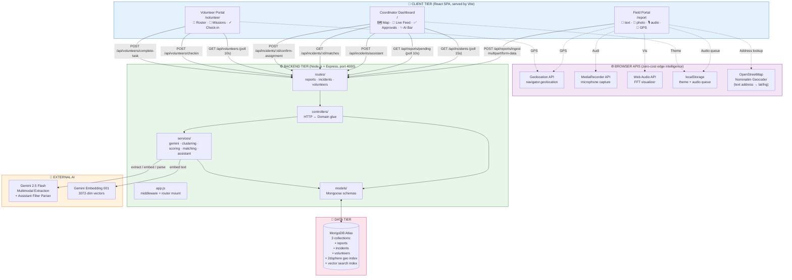
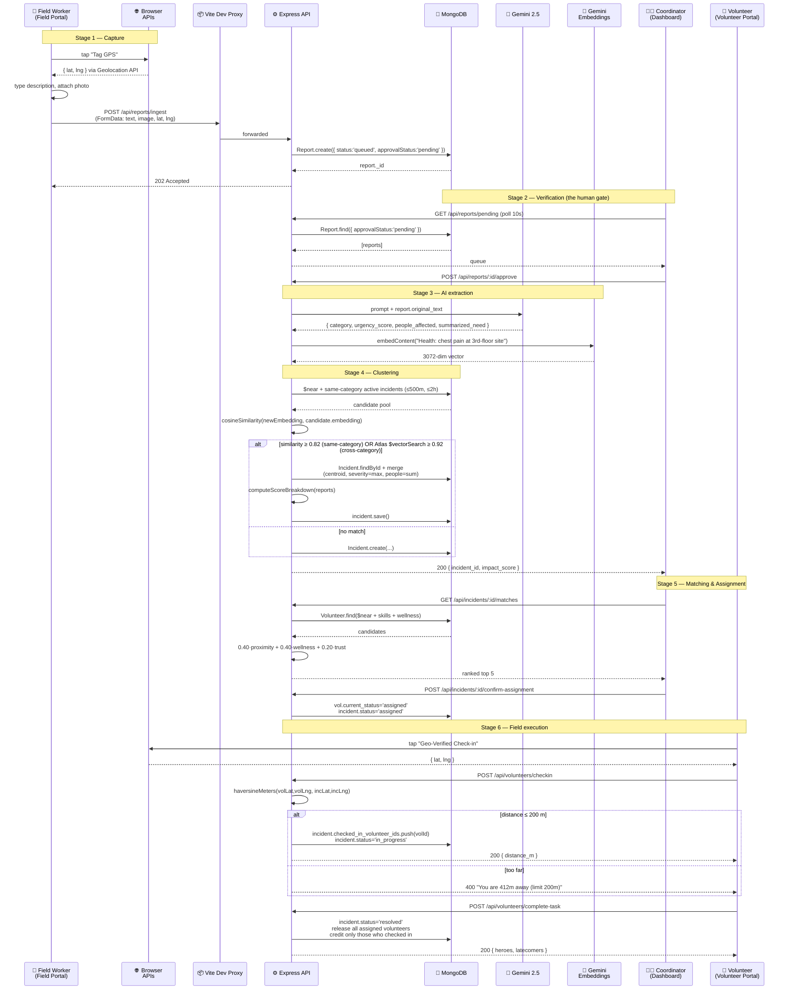

# SRA — The Codebase Masterclass

> A complete, page-by-page, line-by-line architectural deep-dive into the **Smart Resource Allocator** (SRA) — written for an absolute beginner, but framed for FAANG interview-grade computer science fluency.

---

## Table of Contents

1. [What This Document Is](#1-what-this-document-is)
2. [What Is SRA, Really?](#2-what-is-sra-really)
3. [The 30,000-Foot Architecture (Visual)](#3-the-30000-foot-architecture-visual)
4. [The Data Lifecycle — End-to-End Walkthrough](#4-the-data-lifecycle--end-to-end-walkthrough)
5. [Project Skeleton — Folders & Files](#5-project-skeleton--folders--files)
6. [Backend Configuration & Bootstrapping](#6-backend-configuration--bootstrapping)
7. [Backend Middleware Layer](#7-backend-middleware-layer)
8. [Backend Data Models (MongoDB / Mongoose)](#8-backend-data-models-mongodb--mongoose)
9. [Backend Routes (RESTful Surface)](#9-backend-routes-restful-surface)
10. [Backend Controllers (HTTP-to-Domain Glue)](#10-backend-controllers-http-to-domain-glue)
11. [Backend Services (The Brain)](#11-backend-services-the-brain)
12. [Backend Seed Script](#12-backend-seed-script)
13. [Frontend Bootstrapping & Routing](#13-frontend-bootstrapping--routing)
14. [Frontend State, Context, Utilities, API Layer](#14-frontend-state-context-utilities-api-layer)
15. [Frontend Pages — Field, Volunteer](#15-frontend-pages--field-volunteer)
16. [Frontend Components — Map, Feed, Approvals, AudioVisualizer, Misc](#16-frontend-components--map-feed-approvals-audiovisualizer-misc)
17. [Cross-Cutting Themes & Interview-Ready Synthesis](#17-cross-cutting-themes--interview-ready-synthesis)
18. [Security, Routing & RBAC Architecture (v2 Overhaul)](#18-security-routing--rbac-architecture-v2-overhaul)
19. [Developer Setup & Auth Testing](#19-developer-setup--auth-testing)

---

## 1. What This Document Is

This is a guided tour of the SRA codebase for someone who has **never written a line of code** but wants to understand how a real-world humanitarian coordination platform is engineered, from the database all the way up to a button click on a map.

Each piece of code you encounter is broken down using the same **four-section pattern**:

> **THE CODE** — the literal snippet or file/function we are talking about.
> **PLAIN ENGLISH TRANSLATION** — what the code is doing, told as a story you could explain to a non-technical friend.
> **THE ENGINEERING CONCEPT** — the formal computer-science principle the code is an instance of (the kind of thing a FAANG interviewer wants to hear out loud).
> **IN-DEPTH SEARCH TERMS** — 1–3 phrases you can paste into Google to master that concept on your own.

Read this document like a textbook. Skim it like a map. Re-read it like a study guide. By the end, you should be able to walk into an interview and explain the architecture of a non-trivial full-stack system fluently.

---

## 2. What Is SRA, Really?

The **Smart Resource Allocator** is software that solves a very human problem: when something goes wrong in a city — a fallen tree, a flood, a fire, a medical emergency, a hungry family under a flyover — the people on the ground who *see* the problem are almost never the people with the *power, supplies, or authority* to fix it. The information sits trapped in WhatsApp groups, on paper, or in someone's head.

SRA's job is to compress the time between **"a need is observed"** and **"a qualified volunteer is on their way"** from days (the typical reality) to under two hours.

It does this by giving three different kinds of users three different "portals" — three different **front doors** into the same database — and stitching them together with an AI layer that does the heavy thinking.

| Portal | Route | Auth tier | Who uses it | What they do |
|--------|-------|-----------|-------------|--------------|
| **Public Field Portal** | `/` | Public | Anyone with the URL — citizens, field workers | Submit a report: text + photo + voice + GPS. No login required. |
| **Volunteer Registration** | `/register-volunteer` | Public | Citizens applying to join the roster | Sign up with name, email, password, address, phone, domain knowledge. |
| **Hidden Volunteer Login** | `/command-volunteer` | Public (URL-obscured) | Returning volunteers | Authenticate to access missions and the internal field-report portal. |
| **Hidden Admin Login** | `/command-admin` | Public (URL-obscured) | NGO coordinators | Authenticate to access the command center. |
| **Coordinator Dashboard** | `/dashboard` | Admin only (JWT-gated) | NGO admins | Review / approve reports, see incidents on a map, dispatch volunteers. |
| **Volunteer Portal** | `/volunteer` | Volunteer + Admin | Volunteers on the ground (and admins for oversight) | View assigned missions, geo-check-in on arrival, mark complete. |
| **Internal Field Report** | `/report` | Volunteer + Admin | Authenticated reporters | Same form as `/`, but tracked back to the logged-in user. |

All seven surfaces are built with the same technology — React on the front end, Node.js + Express + MongoDB on the back end — but each has a very different design philosophy because each user has a very different need. The split between *public* and *authenticated* surfaces is itself a major architectural decision, examined in depth in [Section 18](#18-security-routing--rbac-architecture-v2-overhaul).

---

## 3. The 30,000-Foot Architecture (Visual)

### 3.1 The Big Picture (Mermaid)



### 3.2 The Three-Tier ASCII Mental Model

```
╔══════════════════════════════════════════════════════════════════════════╗
║                            CLIENT TIER (React)                           ║
║                                                                          ║
║   ┌─────────────────┐   ┌────────────────────┐   ┌────────────────────┐  ║
║   │  /report        │   │  /  (Dashboard)    │   │  /volunteer        │  ║
║   │  FieldPortal    │   │  App.jsx           │   │  VolunteerPortal   │  ║
║   │  ──────────     │   │  ──────────        │   │  ──────────        │  ║
║   │  text+photo+    │   │  Map · Feed ·      │   │  Roster · Tasks ·  │  ║
║   │  audio+GPS      │   │  Approvals · AI    │   │  Geo-check-in      │  ║
║   └────────┬────────┘   └─────────┬──────────┘   └────────┬───────────┘  ║
║            │                      │                       │              ║
║            └──────────────────────┼───────────────────────┘              ║
║                                   │ fetch() / FormData / JSON            ║
╠═══════════════════════════════════│══════════════════════════════════════╣
║                                   ▼  Vite dev-proxy → :4000              ║
║                          BACKEND TIER (Express)                          ║
║                                                                          ║
║   app.js → routes/* → controllers/* → services/* → models/* → MongoDB    ║
║       │                                  │                               ║
║       │                                  └──→ Gemini 2.5 Flash (LLM)     ║
║       │                                  └──→ Gemini Embedding 001       ║
║       └→ middleware: cors, json, morgan, multer, errorHandler            ║
╠══════════════════════════════════════════════════════════════════════════╣
║                              DATA TIER                                   ║
║                                                                          ║
║   MongoDB Atlas:                                                         ║
║     reports        — raw field signals (queued | extracted | clustered)  ║
║     incidents      — clustered, scored, statefully tracked (FSM)         ║
║     volunteers     — roster + wellness + trust + GeoJSON home base       ║
║                                                                          ║
║   Indexes:                                                               ║
║     • reports.approvalStatus, reports.status, reports.worker_id          ║
║     • incidents.category, .impact_score, .status                         ║
║     • incidents.location_centroid (2dsphere)                             ║
║     • incidents.embedding (Atlas vector search, 3072-dim cosine)         ║
║     • volunteers.last_known_location (2dsphere), .skills, .current_status║
╚══════════════════════════════════════════════════════════════════════════╝
```

### 3.3 What you should read off these diagrams

- The system is **three logical tiers** — UI, application server, database — connected by clean, narrow interfaces (HTTP and database queries). Each tier can be swapped out independently. That is the textbook definition of a **3-tier architecture**.
- The **AI is an external dependency**, not a core dependency. If Gemini disappears, the dashboard still works. This is **graceful degradation** baked in at architecture time.
- Browser APIs (Geolocation, MediaRecorder, Web Audio) are doing real work *on the user's device* — that is **edge computation**, free CPU we're getting from each user.
- The `/api/admin/seed-all` route exists to populate Jaipur test data with a single click — this is a **test fixture**, deliberately gated behind an admin path.

---

## 4. The Data Lifecycle — End-to-End Walkthrough

This is the canonical journey of one piece of data — a single field report — from the moment a worker observes a fallen tree to the moment the incident is resolved by a volunteer in the field.

### 4.1 Sequence Diagram (Mermaid)



### 4.2 ASCII version of the same lifecycle

```
[1. CAPTURE]               [2. VERIFY]         [3. EXTRACT]        [4. CLUSTER]
Field Worker                Coordinator          Gemini 2.5         Cosine sim
   │ (text+photo+GPS)         │ "approve"          │ JSON ⇨           │ + $near
   ▼                          ▼                    ▼                  ▼
POST /reports/ingest  ──► Report{queued,    ──► {category,         ──► merge
        ▲                       pending}            urgency,                with active
   202 Accepted          POST /:id/approve         people,                  same-category
   (returns immediately,        ▲                  summarized}              incident OR
   "queued for review")    embedding 3072-d        ▼                        create new
                                                  Report{extracted,
                                                  embedding}        Incident{
                                                                       impact_score,
                                                                       contributing_ids[],
                                                                       location_centroid}

[5. DISPATCH]                                  [6. EXECUTE]
Coordinator                                    Volunteer
   │ "Run Smart Match"                            │ tap "Check-in"
   ▼                                              ▼ (Geolocation API)
GET /:id/matches                               POST /checkin
   │ proximity·0.40                            │ haversine ≤ 200m?
   │ wellness·0.40                             │  yes → in_progress
   │ trust·0.20                                │  no  → 400 error
   ▼                                              ▼
POST /:id/confirm-assignment                   POST /complete-task
   incident.status='assigned'                  incident.status='resolved'
   volunteer.current_status='assigned'         release ALL volunteers,
                                               credit only checked-in heroes
```

#### 4-Part Explanation: The Lifecycle Itself

> **THE CODE**: The entire end-to-end pipeline (`reports.controller.js` → `clustering.service.js` → `matching.service.js` → `volunteers.controller.js`).
>
> **PLAIN ENGLISH**: Imagine a relay race. The field worker hands a baton (the report) to the coordinator. The coordinator inspects it, then hands it to the AI, which writes a label on it. The AI hands it to a *grouping clerk* who decides: "is this a new race or part of an existing race?" The grouping clerk hands the now-grouped baton to a *matchmaker* who picks the best runner. That runner physically goes to the location, proves they're there with their phone's GPS, runs the leg, and crosses the finish line by tapping "complete." Each handoff is a separate function in our code. None of them know what happens before or after them — they only know how to do their one job.
>
> **THE ENGINEERING CONCEPT**: This is a **pipeline architecture** — a chain of single-responsibility stages where the output type of stage *N* is the input type of stage *N+1*. Each stage is independently testable and replaceable (you could swap Gemini for a different LLM without touching clustering). It is also an **event-driven workflow** modeled as a **finite state machine (FSM)** over the `incident.status` field, with valid transitions: `reported → triaged → assigned → in_progress → resolved → verified → closed`. The architecture is fundamentally a producer-consumer pipeline expressed via HTTP rather than a message queue (for now); upgrading to a real queue (BullMQ, Kafka) is the natural Phase-2 migration.
>
> **IN-DEPTH SEARCH TERMS**: "pipes and filters architecture pattern", "finite state machine workflow engine", "event-driven microservice patterns".

---

## 5. Project Skeleton — Folders & Files

```
Smart_Resource_Allocator/
├── README.md                           ← Public project face
├── claude.md                           ← Architectural blueprint (single source of truth)
├── IMPLEMENTATION_LOG.md               ← Development diary
├── backend/
│   ├── .env / .env.example             ← Secrets (MONGODB_URI, GEMINI_API_KEY)
│   ├── package.json                    ← Backend deps + npm scripts
│   └── src/
│       ├── server.js                   ← Process entrypoint (the "main()" of Node)
│       ├── app.js                      ← Express app: middleware + routes
│       ├── config/
│       │   ├── env.js                  ← dotenv loader, PORT/MONGO/GEMINI parsing
│       │   └── db.js                   ← Mongoose connection bootstrap
│       ├── middleware/
│       │   ├── upload.js               ← Multer (in-memory image upload)
│       │   └── errorHandler.js         ← Last-resort error sink
│       ├── middleware/
│       │   ├── upload.js               ← Multer (in-memory image upload)
│       │   ├── errorHandler.js         ← Last-resort error sink
│       │   └── requireRole.js          ← JWT verify + RBAC guard (v2)
│       ├── models/
│       │   ├── Report.js               ← raw signal collection
│       │   ├── Incident.js             ← clustered logical event collection
│       │   ├── Volunteer.js            ← human responder collection
│       │   └── User.js                 ← auth identity + role + profile (v2)
│       ├── routes/
│       │   ├── reports.routes.js
│       │   ├── incidents.routes.js
│       │   ├── volunteers.routes.js
│       │   └── auth.routes.js          ← /login, /register-volunteer (v2)
│       ├── controllers/
│       │   ├── reports.controller.js
│       │   ├── incidents.controller.js
│       │   ├── volunteers.controller.js
│       │   └── auth.controller.js      ← bcrypt + JWT issuance (v2)
│       ├── services/                   ← The brain of the system
│       │   ├── gemini.service.js       ← LLM extraction + embeddings
│       │   ├── assistant.service.js    ← LLM filter parser
│       │   ├── clustering.service.js   ← cosine + $vectorSearch + $near
│       │   ├── scoring.service.js      ← composite Impact Score
│       │   └── matching.service.js     ← weighted volunteer ranking
│       └── scripts/
│           ├── seedCity.js             ← Jaipur synthetic dataset
│           └── seedAuth.js             ← seeds 1 admin + 1 volunteer (v2)
└── frontend/
    ├── package.json
    ├── vite.config.js                  ← Dev server + /api proxy → :4000
    ├── index.html                      ← <div id="root"> + theme-flash guard
    └── src/
        ├── main.jsx                    ← ReactDOM.createRoot + RBAC router (v2)
        ├── App.jsx                     ← Coordinator dashboard shell
        ├── api.js                      ← thin fetch() wrappers (+ authLogin, authRegisterVolunteer)
        ├── util.js                     ← scoreBand, formatRelative, applyAssistantFilter
        ├── styles.css
        ├── context/
        │   ├── ThemeContext.jsx        ← React Context for dark mode
        │   └── AuthContext.jsx         ← JWT + user state, localStorage-backed (v2)
        ├── layouts/                    ← role-aware page chrome (v2)
        │   ├── PublicLayout.jsx        ← landing chrome + "Register" CTA
        │   ├── AdminLayout.jsx         ← dark command-center chrome (forces dark mode)
        │   └── VolunteerLayout.jsx     ← restricted nav (Field Report + My Missions)
        ├── components/
        │   ├── TopBar.jsx              ← AI search input + theme toggle
        │   ├── CommandMap.jsx          ← Leaflet map + IncidentPopup + Smart Match
        │   ├── LiveFeed.jsx            ← unassigned/assigned tabs
        │   ├── PendingApprovals.jsx    ← moderation inbox + audio cards
        │   ├── StatsStrip.jsx          ← bottom KPI bar
        │   ├── StatusCapsule.jsx       ← live clock badge
        │   ├── PortalNav.jsx           ← left sidebar / mobile tabs
        │   ├── ProtectedRoute.jsx      ← PrivateRoute: auth guard + layout selector (v2)
        │   ├── Toast.jsx               ← global notification system
        │   └── AudioVisualizer.jsx     ← Web Audio FFT slabs
        └── pages/
            ├── FieldPortal.jsx         ← / and /report (capture)
            ├── VolunteerPortal.jsx     ← /volunteer (execute)
            ├── VolunteerRegister.jsx   ← /register-volunteer (Framer Motion) (v2)
            ├── VolunteerLogin.jsx      ← /command-volunteer (hidden) (v2)
            └── AdminLogin.jsx          ← /command-admin (hidden, dark) (v2)
```

---

## 6. Backend Configuration & Bootstrapping

### 6.1 `backend/package.json` — declaring the species

> **THE CODE** ([backend/package.json](Smart_Resource_Allocator/backend/package.json))
> ```json
> {
>   "name": "sra-backend",
>   "scripts": {
>     "start": "node src/server.js",
>     "dev": "nodemon src/server.js",
>     "seed": "node seed.js"
>   },
>   "dependencies": {
>     "@google/generative-ai": "^0.21.0",
>     "cors": "^2.8.5",
>     "dotenv": "^16.4.5",
>     "express": "^4.19.2",
>     "mongoose": "^8.5.1",
>     "morgan": "^1.10.0",
>     "multer": "^1.4.5-lts.1"
>   }
> }
> ```
>
> **PLAIN ENGLISH**: This file is the **shopping list and recipe card** for the backend project. It tells Node, "when someone types `npm run dev`, restart the server every time a file changes." It also says: "before any of this works, please install these seven libraries from the global library hall (npm)." `^` means "this version, or any newer compatible one."
>
> **THE ENGINEERING CONCEPT**: A `package.json` is a **manifest file** for the **CommonJS / Node module system**. It pins **semantic-versioned dependencies** (`MAJOR.MINOR.PATCH`) and exposes lifecycle hooks (`scripts`). The caret (`^`) is **SemVer compatibility** — patch and minor upgrades are accepted, breaking-major upgrades are not. This single file is also the contract that lets a fresh CI machine reproduce the exact runtime — combined with `package-lock.json`, it gives you **deterministic, reproducible builds**.
>
> **IN-DEPTH SEARCH TERMS**: "semver caret tilde rules", "Node.js package.json scripts lifecycle", "npm package-lock deterministic install".

### 6.2 `backend/src/server.js` — the process entrypoint

> **THE CODE** ([server.js:1-17](Smart_Resource_Allocator/backend/src/server.js#L1-L17))
> ```js
> const app = require('./app');
> const connectDB = require('./config/db');
> const env = require('./config/env');
>
> async function start() {
>   try {
>     await connectDB();
>     app.listen(env.PORT, () => {
>       console.log(`[server] SRA backend listening on :${env.PORT} (${env.NODE_ENV})`);
>     });
>   } catch (err) {
>     console.error('[server] Failed to start:', err);
>     process.exit(1);
>   }
> }
> start();
> ```
>
> **PLAIN ENGLISH**: This is the *first thing that runs* when the backend turns on. Imagine flipping on a coffee shop in the morning: first you connect the building to electricity (`connectDB`), and only *after* the lights are on do you unlock the front door for customers (`app.listen`). If electricity fails, you don't pretend to be open — you flip the closed sign and walk out (`process.exit(1)`).
>
> **THE ENGINEERING CONCEPT**: This is **fail-fast startup ordering**. The `await connectDB()` enforces a happens-before relationship: HTTP traffic *cannot* reach the server until the database handshake is complete. A non-zero `process.exit(1)` is the **POSIX exit code** convention — orchestrators like Docker, PM2, or Kubernetes interpret a non-zero exit as a crash and trigger restarts. The `try/catch` around an `await` is **promise error funnelling** — turning any failure in the entire startup chain into a single recoverable event.
>
> **IN-DEPTH SEARCH TERMS**: "Node.js graceful startup shutdown", "POSIX exit codes orchestrator", "async/await error handling top-level".

### 6.3 `backend/src/app.js` — the wiring board

> **THE CODE** ([app.js:11-44](Smart_Resource_Allocator/backend/src/app.js#L11-L44))
> ```js
> const app = express();
>
> app.use(cors());
> app.use(express.json({ limit: '1mb' }));
> app.use(express.urlencoded({ extended: true }));
> app.use(morgan('dev'));
>
> app.get('/health', (req, res) => res.json({ status: 'ok', service: 'sra-backend' }));
>
> app.use('/api/reports', reportsRoutes);
> app.use('/api/incidents', incidentsRoutes);
> app.use('/api/volunteers', volunteersRoutes);
>
> app.get('/api/incidents/:id/matches', getMatches);
> app.post('/api/incidents/:id/confirm-assignment', confirmAssignment);
>
> app.post('/api/admin/seed-all', /* ... */);
> app.use((req, res) => res.status(404).json(/* not found */));
> app.use(errorHandler);
> ```
>
> **PLAIN ENGLISH**: Think of `app` as a **factory conveyor belt**. Each `app.use(...)` is a **station** that touches every request as it rolls past. `cors()` slaps a sticker on saying "browsers from other domains may speak to me." `express.json()` opens any JSON-shaped envelopes. `morgan` writes a one-line log. Then we **mount three sub-conveyors** (`/api/reports`, `/api/incidents`, `/api/volunteers`), each a smaller belt for its category. Finally, anything that fell off the belt without being handled goes to the 404 trash bin, and anything that *broke* on the belt goes to the error-handler dustpan.
>
> **THE ENGINEERING CONCEPT**: This is the **Express middleware pipeline**, a textbook example of the **Chain of Responsibility design pattern**. Middlewares run in registration order; calling `next()` (implicitly via the controller returning) advances the chain. The error handler is special — its function signature has *four* parameters `(err, req, res, next)`, which is how Express recognizes it and skips to it on `next(err)`. Order matters: `app.use(errorHandler)` **must** be last, because Express walks the registration list top-to-bottom. The 1 MB JSON body limit is a **defense-in-depth** measure against denial-of-service via giant payloads — you size body parsers based on your domain's realistic max.
>
> **IN-DEPTH SEARCH TERMS**: "Express middleware chain of responsibility pattern", "CORS preflight OPTIONS browser security", "express error-handling middleware four arity".

### 6.4 `backend/src/config/env.js` — environment isolation

> **THE CODE** ([config/env.js:1-15](Smart_Resource_Allocator/backend/src/config/env.js#L1-L15))
> ```js
> require('dotenv').config();
>
> const required = ['MONGODB_URI', 'GEMINI_API_KEY'];
> const missing = required.filter((key) => !process.env[key]);
> if (missing.length) console.warn(`[env] Missing required env vars: ${missing.join(', ')}`);
>
> module.exports = {
>   PORT: Number(process.env.PORT) || 4000,
>   NODE_ENV: process.env.NODE_ENV || 'development',
>   MONGODB_URI: process.env.MONGODB_URI,
>   GEMINI_API_KEY: process.env.GEMINI_API_KEY,
>   GEMINI_MODEL: process.env.GEMINI_MODEL || 'gemini-2.5-flash',
> };
> ```
>
> **PLAIN ENGLISH**: Secrets — like the password to the database — should *never* be written into the code itself, because the code goes onto GitHub and the secrets shouldn't. Instead, we keep them in a hidden file called `.env`. This file's job is to read that hidden file, double-check the required ones are there, and hand them to the rest of the app in a clean dictionary.
>
> **THE ENGINEERING CONCEPT**: **The Twelve-Factor App, Factor III: Config in environment.** Hard-coded secrets are a security and portability disaster. Environment variables let the same compiled binary run in dev, staging, and prod with different secrets — no rebuild required. The `|| 4000` and `|| 'development'` are **safe-default fallbacks**. Notice the early **fail-loud-but-don't-crash** behavior: a *warning* on missing vars rather than a hard exit. This is a deliberate choice for development — production deployments should escalate this to `process.exit(1)`.
>
> **IN-DEPTH SEARCH TERMS**: "twelve-factor app config", "dotenv security best practices", "secret management 12-factor".

### 6.5 `backend/src/config/db.js` — connecting to MongoDB

> **THE CODE** ([config/db.js:1-13](Smart_Resource_Allocator/backend/src/config/db.js#L1-L13))
> ```js
> async function connectDB() {
>   if (!env.MONGODB_URI) throw new Error('MONGODB_URI is not set...');
>   mongoose.set('strictQuery', true);
>   await mongoose.connect(env.MONGODB_URI);
>   console.log('[db] MongoDB connected');
> }
> ```
>
> **PLAIN ENGLISH**: This is the function that picks up the phone and dials the database in the cloud. `strictQuery: true` is a polite "please reject typos in my queries" setting — if I ask for `incident.fooBar` and there's no `fooBar` field, complain instead of silently returning nothing.
>
> **THE ENGINEERING CONCEPT**: Mongoose is an **ODM** (Object-Document Mapper) — the NoSQL counterpart of an ORM. It abstracts the raw MongoDB driver and adds **schema validation**, **middleware (hooks)**, and **type casting**. `strictQuery` enforces **schema-shape integrity at query time** — without it, MongoDB's permissiveness can silently swallow typos. Under the hood, Mongoose maintains a **connection pool** (default 5 sockets) and pipelines queries; calling `connect()` is non-blocking after the initial handshake.
>
> **IN-DEPTH SEARCH TERMS**: "Mongoose ODM vs MongoDB driver", "MongoDB connection pool tuning", "strictQuery option Mongoose 7".

---

## 7. Backend Middleware Layer

### 7.1 `middleware/upload.js` — receiving images safely

> **THE CODE** ([middleware/upload.js:1-17](Smart_Resource_Allocator/backend/src/middleware/upload.js#L1-L17))
> ```js
> const multer = require('multer');
> const MAX_FILE_SIZE_MB = 10;
> function fileFilter(req, file, cb) {
>   if (!file) return cb(null, true);
>   if (file.mimetype && file.mimetype.startsWith('image/')) return cb(null, true);
>   cb(new Error('Only image files are allowed'));
> }
> const upload = multer({
>   storage: multer.memoryStorage(),
>   limits: { fileSize: MAX_FILE_SIZE_MB * 1024 * 1024 },
>   fileFilter,
> });
> ```
>
> **PLAIN ENGLISH**: When a phone uploads a photo, the data doesn't arrive as JSON — it arrives in chunks (called "multipart"). Multer is a **doorman** that catches those chunks and re-assembles them into a usable file. We tell it three rules: (1) keep the file in memory (RAM), don't write to disk; (2) reject anything bigger than 10 MB; (3) only accept images, no PDFs or executables.
>
> **THE ENGINEERING CONCEPT**: This is a **multipart/form-data parser** for HTTP file uploads, defined by **RFC 7578**. `memoryStorage()` is a deliberate trade: faster (no disk I/O) but a **memory pressure / DoS attack vector** if the size limit isn't strict. `fileFilter` is a **content-type allowlist** — never rely on file extensions, always inspect MIME. The 10 MB cap is a **hard limit on adversarial input** — without it, a malicious client could exhaust server RAM.
>
> **IN-DEPTH SEARCH TERMS**: "multipart form-data RFC 7578", "Multer memoryStorage vs diskStorage tradeoff", "file upload DoS prevention size limit".

### 7.2 `middleware/errorHandler.js` — the last safety net

> **THE CODE** ([middleware/errorHandler.js:1-15](Smart_Resource_Allocator/backend/src/middleware/errorHandler.js#L1-L15))
> ```js
> function errorHandler(err, req, res, next) {
>   if (err instanceof multer.MulterError) {
>     return res.status(400).json({ error: `Upload error: ${err.message}` });
>   }
>   console.error('[error]', err);
>   const status = err.status || 500;
>   res.status(status).json({ error: err.message || 'Internal server error' });
> }
> ```
>
> **PLAIN ENGLISH**: If anything anywhere in the request blows up, this is the **emergency room**. It checks if the error is a known type (a Multer upload mistake → tell the user nicely), or an unexpected one (log it for developers, show the user a generic message).
>
> **THE ENGINEERING CONCEPT**: **Centralized error handling**. Express recognizes 4-arity middleware as error-handler. The `instanceof` check is **type narrowing** — different exception types map to different HTTP semantics (400 = client mistake, 500 = our mistake). Never leak stack traces to clients in production — that is **information disclosure**, an OWASP-listed vulnerability.
>
> **IN-DEPTH SEARCH TERMS**: "Express centralized error handler pattern", "OWASP information disclosure stack trace", "HTTP status codes 4xx vs 5xx semantics".

---

## 8. Backend Data Models (MongoDB / Mongoose)

The data model is the **constitution** of the system. If the schemas are right, everything flows. If they're wrong, no amount of clever code will save you.

### 8.1 `models/Report.js` — raw signal

> **THE CODE** ([models/Report.js](Smart_Resource_Allocator/backend/src/models/Report.js))
> ```js
> const reportSchema = new mongoose.Schema({
>   worker_id: { type: String, default: 'anonymous', index: true },
>   original_text: { type: String, required: true },
>   media_refs: [mediaRefSchema],
>   gps_coordinates: gpsSchema,
>   extracted_fields: extractedFieldsSchema,
>   status: { type: String, enum: ['queued','processing','extracted','clustered','review_required','discarded'],
>     default: 'queued', index: true },
>   submitted_at: { type: Date, default: Date.now },
>   incident_id: { type: mongoose.Schema.Types.ObjectId, ref: 'Incident', default: null },
>   embedding: { type: [Number], default: undefined },
>   approvalStatus: { type: String, enum: ['pending','approved','rejected'], default: 'pending', index: true },
> }, { timestamps: true });
> ```
>
> **PLAIN ENGLISH**: A `Report` is the *raw* observation — what one human person said and saw at one moment. It's like a witness statement. We track who said it, what they said, *where* they were, when, what photo (if any) they attached, and a journey of states it passes through: it starts as `queued` (just submitted), waits as `pending` for a coordinator's blessing, becomes `extracted` once Gemini has read it, and graduates to `clustered` when it's been merged with related reports into a logical incident.
>
> **THE ENGINEERING CONCEPT**: This document is a model of an **append-mostly event** in event-sourcing parlance — its `status` is a **finite state machine**, the `enum` constraint enforces only valid transitions at write-time. `index: true` on hot read paths (`worker_id`, `status`, `approvalStatus`) keeps queue queries O(log n) instead of O(n). The `embedding: [Number]` field stores a 3072-dimensional float vector — 3072 numbers per row — which is heavy but unlocks **semantic search via Atlas Vector Search**. The `incident_id` ref builds a **foreign-key-like back-reference** that becomes essential when the coordinator needs to drill from incident → contributing reports.
>
> **IN-DEPTH SEARCH TERMS**: "MongoDB schema design embedded vs referenced", "FSM via enum string field", "Mongoose Schema.Types.ObjectId ref population".

### 8.2 `models/Incident.js` — the clustered logical event

> **THE CODE** ([models/Incident.js:61-112](Smart_Resource_Allocator/backend/src/models/Incident.js#L61-L112))
> ```js
> const incidentSchema = new mongoose.Schema({
>   category: { type: String, enum: ['Health','Food','Water','Shelter','Infrastructure','Education','Safety','Other'],
>     required: true, index: true },
>   severity: { type: Number, min: 1, max: 10 },
>   estimated_people_affected: { type: Number, default: 0 },
>   location_centroid: pointSchema,
>   sanitized_location: pointSchema,
>   contributing_report_ids: [{ type: mongoose.Schema.Types.ObjectId, ref: 'Report' }],
>   impact_score: { type: Number, default: 0, index: true },
>   score_breakdown: scoreBreakdownSchema,
>   status: { type: String, enum: ['reported','triaged','assigned','in_progress','resolved','verified','closed'],
>     default: 'reported', index: true },
>   assigned_volunteer_ids: [{ type: ..., ref: 'Volunteer' }],
>   checked_in_volunteer_ids: [{ type: ..., ref: 'Volunteer' }],
>   embedding: { type: [Number], default: undefined },
> }, { timestamps: { createdAt: 'created_at', updatedAt: 'last_updated_at' } });
>
> incidentSchema.index({ location_centroid: '2dsphere' });
> incidentSchema.index({ sanitized_location: '2dsphere' });
> ```
>
> **PLAIN ENGLISH**: A `Report` is one person's voice; an `Incident` is the **conversation** that emerges when many people independently report the *same* thing. It's the thing the dashboard actually shows on the map. We store an aggregate centroid of the GPS points (where, on average, this is happening), a "sanitized" copy with random noise added (for the public view, so we don't pinpoint a vulnerable family's exact apartment), the calculated `impact_score`, and pointers back to the contributing reports so we never lose the audit trail.
>
> **THE ENGINEERING CONCEPT**: This is the **aggregate root** in Domain-Driven Design — a single entity that owns a cluster of subordinate entities (the contributing reports). The `2dsphere` index on `location_centroid` is what makes `$near` and `$geoWithin` queries fast — without it, every spatial query becomes O(n) scan. The dual indexes (one on real, one on sanitized) embody **Privacy-at-Read-Boundary**: the same physical document supports both the operator's full-fidelity view and the public's deliberately-fuzzy view. Storing `score_breakdown` (not just the final score) is **explainable AI** — every ranking can be justified to a human stakeholder.
>
> **IN-DEPTH SEARCH TERMS**: "Domain-Driven Design aggregate root", "MongoDB 2dsphere index GeoJSON queries", "explainable AI XAI score breakdown".

### 8.3 `models/Volunteer.js` — the human responder

> **THE CODE** ([models/Volunteer.js](Smart_Resource_Allocator/backend/src/models/Volunteer.js))
> ```js
> const volunteerSchema = new mongoose.Schema({
>   name: { type: String, required: true },
>   skills: [{ type: String, index: true }],
>   transportation_mode: { type: String, enum: ['walk','bicycle','motorcycle','car','public_transit'], default: 'walk' },
>   availability_windows: [availabilityWindowSchema],
>   current_status: { type: String, enum: ['available','assigned','resting','offline'],
>     default: 'available', index: true },
>   last_known_location: pointSchema,
>   service_radius: { type: Number, default: 10 },
>   active_assignments: [{ type: ..., ref: 'Incident' }],
>   hours_last_7_days: { type: Number, default: 0 },
>   wellness_score: { type: Number, default: 1.0, min: 0, max: 1 },
>   wellness_flags: [wellnessFlagSchema],
>   mandatory_rest_until: { type: Date, default: null },
>   trust_score: { type: Number, default: 0.5, min: 0, max: 1 },
>   total_assignments: { type: Number, default: 0 },
>   total_resolved: { type: Number, default: 0 },
> }, { timestamps: ... });
> volunteerSchema.index({ last_known_location: '2dsphere' });
> ```
>
> **PLAIN ENGLISH**: A `Volunteer` is a person on call. We track *what they can do* (skills), *how they get around* (transport), *when they're free* (availability windows), *where they last were* (location), and crucially, *whether the system thinks they're at risk of burning out* (`wellness_score`, `mandatory_rest_until`). If `mandatory_rest_until` is in the future, the system **forbids itself** from giving this person more work, even if they want it.
>
> **THE ENGINEERING CONCEPT**: This schema encodes a **business invariant directly into the data model**: protecting volunteers from themselves. The `min: 0, max: 1` clamping on `wellness_score` and `trust_score` keeps these values **normalized in [0,1]** — a math-friendly range that lets you multiply them together without weird scale issues. Storing both `total_assignments` and `total_resolved` lets `completion_rate` be derived (`resolved/assignments`), which is **denormalization for read performance** — yes, you could compute it on the fly, but pre-computing is one less aggregation per dashboard render.
>
> **IN-DEPTH SEARCH TERMS**: "denormalization in NoSQL design", "business invariant in domain model", "rolling 7-day workload tracking schema".

### 8.4 GeoJSON `Point` — why coordinates are stored `[lng, lat]`

> **THE CODE** (shared `pointSchema` in both [Incident.js](Smart_Resource_Allocator/backend/src/models/Incident.js) and [Volunteer.js](Smart_Resource_Allocator/backend/src/models/Volunteer.js))
> ```js
> const pointSchema = new mongoose.Schema({
>   type: { type: String, enum: ['Point'], default: 'Point' },
>   coordinates: { type: [Number], required: true }, // [lng, lat]
> }, { _id: false });
> ```
>
> **PLAIN ENGLISH**: There is one famous gotcha in maps: **longitude comes first**, latitude second. Most humans say "lat-long" but the GeoJSON standard says "lng-lat." If you reverse them, you put a Mumbai pin somewhere in Antarctica.
>
> **THE ENGINEERING CONCEPT**: GeoJSON is **RFC 7946**. The `[longitude, latitude]` order matches the mathematical convention `[x, y]`. MongoDB's geospatial operators (`$near`, `$geoWithin`, `$centerSphere`) require GeoJSON-formatted points; otherwise they error or silently mismatch. This is the kind of "no-amount-of-types-saves-you-from-conventions" trap senior engineers learn the hard way once.
>
> **IN-DEPTH SEARCH TERMS**: "GeoJSON RFC 7946 coordinate order", "MongoDB GeoJSON Point indexing", "longitude latitude vs latitude longitude bug".

---

## 9. Backend Routes (RESTful Surface)

### 9.1 `routes/reports.routes.js`

> **THE CODE** ([reports.routes.js](Smart_Resource_Allocator/backend/src/routes/reports.routes.js))
> ```js
> router.post('/ingest', upload.single('image'), ingestReport);
> router.get('/pending', getPendingReports);
> router.post('/:id/approve', approveReport);
> router.post('/:id/reject', rejectReport);
> ```
>
> **PLAIN ENGLISH**: This is the **menu of doors** for everything to do with reports. Submit a new report, check the pending queue, approve a specific one, reject a specific one. Notice the second argument on the first line — `upload.single('image')` — that's the doorman from earlier, run *only* on the ingest door because that's the only door that accepts files.
>
> **THE ENGINEERING CONCEPT**: This is **RESTful resource routing** — URLs name nouns, HTTP methods name verbs. The `/:id` pattern is a **route parameter** (path variable) — Express extracts it into `req.params.id`. Mounting middleware *only on the route that needs it* (the upload parser) is a **principle of least privilege** applied to middleware: don't pay parsing cost on routes that don't need it. The `/approve` and `/reject` endpoints are RPC-flavored verbs on a noun resource — a pragmatic compromise where strict REST ("PATCH /reports/:id with body `{status: 'approved'}`") would lose intent.
>
> **IN-DEPTH SEARCH TERMS**: "RESTful API design verbs vs nouns", "Express route-level middleware", "RPC vs REST resource modeling".

### 9.2 `routes/incidents.routes.js` and `routes/volunteers.routes.js`

> **THE CODE** ([incidents.routes.js](Smart_Resource_Allocator/backend/src/routes/incidents.routes.js) + [volunteers.routes.js](Smart_Resource_Allocator/backend/src/routes/volunteers.routes.js))
> ```js
> // incidents
> router.get('/', listOpenIncidents);
> router.post('/assistant', assistantQuery);
>
> // volunteers
> router.get('/', listVolunteers);
> router.post('/seed', seedVolunteers);
> router.post('/checkin', geoCheckin);
> router.post('/complete-task', completeTask);
> ```
>
> Note in [app.js:27-28](Smart_Resource_Allocator/backend/src/app.js#L27-L28) we also mount **cross-resource** endpoints:
> ```js
> app.get('/api/incidents/:id/matches', getMatches);
> app.post('/api/incidents/:id/confirm-assignment', confirmAssignment);
> ```
>
> **PLAIN ENGLISH**: The matches and confirm-assignment endpoints are **about an incident** but **powered by the volunteer matching pipeline**. So the URL says "incidents" (the noun the coordinator is thinking about) but the function imported lives in the volunteers controller. That's a deliberate UX-driven URL choice.
>
> **THE ENGINEERING CONCEPT**: This is **API ergonomics over file-system tidiness**. The URL is the public contract; the code organization is internal. They don't have to mirror each other. The router exporter pattern (`module.exports = { router, getMatches, confirmAssignment }`) is a **named-exports** trick that lets one file expose both the prefab router and the individual controller functions for the parent app to compose itself. This is a reusable pattern when one resource's endpoints belong philosophically on a different mount path.
>
> **IN-DEPTH SEARCH TERMS**: "REST API URL design pragmatism", "Express modular router composition", "named exports vs default exports CommonJS".

---

## 10. Backend Controllers (HTTP-to-Domain Glue)

### 10.1 `controllers/reports.controller.js` — `ingestReport`

> **THE CODE** ([reports.controller.js:8-38](Smart_Resource_Allocator/backend/src/controllers/reports.controller.js#L8-L38))
> ```js
> async function ingestReport(req, res, next) {
>   try {
>     const { description, worker_id, lat, lng, submitted_at } = req.body;
>     if (!description || !description.trim()) {
>       return res.status(400).json({ error: "Field 'description' is required" });
>     }
>     const file = req.file || null;
>     const report = await Report.create({
>       worker_id: worker_id || 'anonymous',
>       original_text: description,
>       media_refs: file ? [{ filename: file.originalname, mimetype: file.mimetype, size: file.size }] : [],
>       gps_coordinates: lat && lng ? { lat: Number(lat), lng: Number(lng) } : undefined,
>       status: 'queued',
>       approvalStatus: 'pending',
>       submitted_at: submitted_at ? new Date(submitted_at) : new Date(),
>     });
>     return res.status(202).json({ message: '...queued for coordinator review.', report_id: report._id, status: report.status });
>   } catch (err) { next(err); }
> }
> ```
>
> **PLAIN ENGLISH**: A field worker hits "Submit." This function catches it. It checks the only mandatory thing (a description), bundles the rest of what arrived into a row in the database, sets the status to `queued / pending`, and immediately answers the worker: "Got it, your report is in the queue, here's your tracking number" — *without* doing any AI work yet. The AI runs *later*, only after a coordinator approves.
>
> **THE ENGINEERING CONCEPT**: HTTP `202 Accepted` (not `201 Created`) is the precise verb here — the resource exists, but processing is asynchronous. This is **asynchronous request-reply / fire-and-acknowledge** pattern. By **decoupling ingestion from processing**, the API stays sub-100ms responsive even when Gemini is slow or down. It also creates a **human verification gate** — required because field reports can be wrong, malicious, or duplicates, and we don't want noise reaching the Live Feed unfiltered. `next(err)` punts errors to the centralized error handler from earlier.
>
> **IN-DEPTH SEARCH TERMS**: "HTTP 202 Accepted vs 201 Created", "asynchronous request-reply pattern", "human-in-the-loop AI moderation".

### 10.2 `approveReport` — the AI ignition switch

> **THE CODE** ([reports.controller.js:52-111](Smart_Resource_Allocator/backend/src/controllers/reports.controller.js#L52-L111))
> ```js
> async function approveReport(req, res, next) {
>   const report = await Report.findById(req.params.id);
>   // ... null-check, idempotency-check ...
>   let extracted = await extractFromReport({ text: report.original_text, ... });
>   let embedding = null;
>   try { embedding = await generateEmbedding(`${extracted.category}: ${extracted.summarized_need}`); }
>   catch (embErr) { console.warn('embedding failed — clustering will use category fallback'); }
>   report.extracted_fields = extracted;
>   report.status = 'extracted';
>   report.approvalStatus = 'approved';
>   if (embedding) report.embedding = embedding;
>   await report.save();
>   const incident = await attachReportToIncident(report, embedding);
>   if (incident) { report.incident_id = incident._id; report.status = 'clustered'; await report.save(); }
>   return res.json({ /* ... */ });
> }
> ```
>
> **PLAIN ENGLISH**: When the coordinator presses "Approve," *this* is what runs. We call Gemini twice: first to read the text and write a label `{ category, urgency, people, summary }`, then to convert that summary into a 3072-number "fingerprint" used by clustering. We save those onto the report, then ask the clustering service: "is there an existing incident this should join?" If yes, merge. If no, create a new incident.
>
> **THE ENGINEERING CONCEPT**: **Lazy / on-demand AI invocation** — we pay the LLM cost *only* on approval, not on submission. This is **cost-optimized AI gating**. The two `try/catch` blocks around extraction and embedding are **graceful degradation** — embedding failure does not block extraction, and extraction failure surfaces as a `502 Bad Gateway` rather than a generic 500 (a more honest description of "I am healthy but my upstream isn't"). The two-`save()` pattern is acceptable here because there is no concurrency risk for this report — the coordinator is the only writer of this transition.
>
> **IN-DEPTH SEARCH TERMS**: "lazy evaluation in AI pipelines cost optimization", "HTTP 502 Bad Gateway upstream error", "graceful degradation in distributed systems".

### 10.3 `controllers/incidents.controller.js` — `listOpenIncidents`

> **THE CODE** ([incidents.controller.js:8-82](Smart_Resource_Allocator/backend/src/controllers/incidents.controller.js#L8-L82))
> ```js
> const incidents = await Incident.find({ status: { $in: OPEN_STATUSES } })
>   .sort({ impact_score: -1, last_updated_at: -1 })
>   .limit(500).lean();
>
> const reportIds = [];
> for (const inc of incidents) {
>   if (Array.isArray(inc.contributing_report_ids)) {
>     for (const rid of inc.contributing_report_ids) reportIds.push(rid);
>   }
> }
> const reports = reportIds.length ? await Report.find({ _id: { $in: reportIds } }).select('...').lean() : [];
> const reportById = new Map(reports.map((r) => [String(r._id), r]));
>
> const allVolunteerIds = [...new Set(incidents.flatMap((inc) => inc.assigned_volunteer_ids || []))];
> const volunteers = allVolunteerIds.length ? await Volunteer.find({ _id: { $in: allVolunteerIds } }).select('_id name').lean() : [];
> const volunteerById = new Map(volunteers.map((v) => [String(v._id), v.name]));
> // ... enriched mapping ...
> ```
>
> **PLAIN ENGLISH**: The dashboard wants a list of incidents, *each* annotated with its summary text (which lives on a contributing report) and the names of any assigned volunteers. The naive way is to loop over incidents and run a query inside each loop iteration — but if you have 500 incidents, that's 1001 round-trips to the database (the dreaded **N+1 query problem**). Instead, this code does it in **three queries total**: one for incidents, one for *all* report IDs at once, one for *all* volunteer IDs at once. Then it builds in-memory lookup tables (`Map`) and stitches the data together in JavaScript.
>
> **THE ENGINEERING CONCEPT**: **N+1 query elimination via batch fetching + hash-map join.** The `$in` operator becomes `IN (...)` in SQL terms — a single round-trip with multiple values. Building a `Map` keyed by ID gives **O(1) lookup** during the merge step, so the overall complexity stays **O(I + R + V)** linear in document counts rather than **O(I × R)** quadratic. `.lean()` returns plain JavaScript objects rather than full Mongoose-hydrated documents — measurably faster and less memory because it skips the change-tracking machinery. The two-level sort `(impact_score DESC, last_updated_at DESC)` is **lexicographic ordering** — a tie-breaker policy.
>
> **IN-DEPTH SEARCH TERMS**: "N+1 query problem batch fetching", "Mongoose lean queries performance", "in-memory hash join vs database join".

### 10.4 `assistantQuery` — natural-language → MongoDB filter

> **THE CODE** ([incidents.controller.js:84-100](Smart_Resource_Allocator/backend/src/controllers/incidents.controller.js#L84-L100))
> ```js
> async function assistantQuery(req, res, next) {
>   try {
>     const { query } = req.body || {};
>     if (!query || !String(query).trim()) return res.status(400).json({ error: "Field 'query' is required" });
>     const filter = await parseAssistantQuery(String(query).trim());
>     return res.json({ query, filter });
>   } catch (err) {
>     return res.status(200).json({ query: req.body?.query || '',
>       filter: { categories: [], min_impact_score: 0, keywords: [], rationale: 'Assistant unavailable — showing all incidents.' },
>       degraded: true });
>   }
> }
> ```
>
> **PLAIN ENGLISH**: Coordinator types "show me high priority safety stuff in the last hour." This function calls Gemini, asking it to translate that English sentence into a structured filter object (`{categories: ['Safety'], min_impact_score: 0.5, ...}`). If Gemini is broken, we return a **degraded** but successful response (`degraded: true`) with an empty filter — the dashboard works, just without filtering.
>
> **THE ENGINEERING CONCEPT**: This is **structured generation / function-calling pattern** — the LLM's job is not to write prose, it is to fill a JSON schema. Notice the response on failure is `200 OK` with `degraded: true`, not a `5xx` — the API is signalling "I succeeded, but with reduced functionality." This is a **bulkhead + fallback pattern**: the failure of an *enhancement* feature must not propagate as a failure of the *core* dashboard. The choice between `4xx`, `5xx`, and `200-with-degraded-flag` is itself a meaningful design decision about UX vs observability.
>
> **IN-DEPTH SEARCH TERMS**: "LLM structured output JSON schema", "bulkhead pattern resilience", "graceful degradation API response design".

### 10.5 `controllers/volunteers.controller.js` — `getMatches`

> **THE CODE** ([volunteers.controller.js:151-175](Smart_Resource_Allocator/backend/src/controllers/volunteers.controller.js#L151-L175))
> ```js
> async function getMatches(req, res, next) {
>   const { id } = req.params;
>   const incident = await Incident.findById(id).lean();
>   if (!incident) return res.status(404).json({ error: 'Incident not found' });
>   const ranked = await findBestVolunteers(id, { limit: 5 });
>   if (ranked.length === 0) return res.json({ incident_id: id, candidates: [] });
>   return res.json({ incident_id: id, candidates: ranked.map(...) });
> }
> ```
>
> **PLAIN ENGLISH**: When the coordinator clicks "Run Smart Match" on an incident, this function asks the matching service "give me the top 5 volunteers for this," then sends back their names + scores + breakdown of *why* they ranked where they did.
>
> **THE ENGINEERING CONCEPT**: This endpoint is **read-only / idempotent** — it never mutates state. That's why the verb is `GET`, not `POST`. The `breakdown` field is again **explainable AI**: the coordinator sees not just "top match" but "94% match (proximity 0.95, wellness 0.92, trust 0.96)." A repeatedly-called pure read is also **cacheable** by HTTP infrastructure.
>
> **IN-DEPTH SEARCH TERMS**: "HTTP idempotency safe methods", "explainable ranking models", "RESTful read-only endpoint design".

### 10.6 `confirmAssignment` — the multi-write transition

> **THE CODE** ([volunteers.controller.js:180-235](Smart_Resource_Allocator/backend/src/controllers/volunteers.controller.js#L180-L235))
> ```js
> // ... validate input + load entities ...
> await Promise.all(volunteers.map((vol) => {
>   vol.current_status = 'assigned';
>   vol.active_assignments.push(incident._id);
>   vol.total_assignments += 1;
>   return vol.save();
> }));
> incident.status = 'assigned';
> for (const vol of volunteers) {
>   incident.assigned_volunteer_ids.push(vol._id);
>   incident.assignment_history.push({ volunteer_id: String(vol._id), assigned_at: now, status: 'assigned' });
> }
> await incident.save();
> ```
>
> **PLAIN ENGLISH**: Confirming an assignment touches **multiple** records: every selected volunteer's status flips to "assigned," and the incident gets each volunteer's ID appended. We use `Promise.all` so all the volunteer updates happen *concurrently* instead of one at a time.
>
> **THE ENGINEERING CONCEPT**: `Promise.all` is **concurrent fan-out** — the network round-trips happen in parallel rather than serially, cutting wall-clock time. Two caveats senior engineers will press you on: (1) this is **not transactional** — if the third volunteer save fails, the first two are already committed and we have a partial state; a hardened version would use **MongoDB multi-document transactions** (`session.startTransaction`). (2) `Promise.all` has fail-fast semantics — one rejection rejects the whole; `Promise.allSettled` would let you collect all results regardless.
>
> **IN-DEPTH SEARCH TERMS**: "Promise.all vs Promise.allSettled", "MongoDB multi-document transactions", "eventual consistency partial write recovery".

### 10.7 `geoCheckin` — the haversine guard

> **THE CODE** ([volunteers.controller.js:8-17 and 314-379](Smart_Resource_Allocator/backend/src/controllers/volunteers.controller.js#L8-L17))
> ```js
> function haversineMeters(lat1, lng1, lat2, lng2) {
>   const R = 6_371_000;
>   const toRad = (d) => (d * Math.PI) / 180;
>   const dLat = toRad(lat2 - lat1);
>   const dLng = toRad(lng2 - lng1);
>   const a = Math.sin(dLat/2)**2 + Math.cos(toRad(lat1))*Math.cos(toRad(lat2))*Math.sin(dLng/2)**2;
>   return R * 2 * Math.atan2(Math.sqrt(a), Math.sqrt(1 - a));
> }
> // ...
> const distanceM = haversineMeters(lat, lng, incLat, incLng);
> if (distanceM > GEO_VERIFY_RADIUS_M) return res.status(400).json({ error: `Must be on-site...` });
> // mark arrival idempotently, advance status reported→in_progress
> ```
>
> **PLAIN ENGLISH**: A volunteer claims to have arrived. The phone reports its latitude/longitude. The server compares the volunteer's coordinates with the incident's coordinates using a formula called **Haversine** — it accounts for the Earth being a sphere. If they're more than 200 meters apart, the server says "no, you're not actually there, try again." If within 200 meters, the volunteer is added to the `checked_in_volunteer_ids` list (skipping if already there — that's idempotency), and the incident's status flips from `assigned` to `in_progress`.
>
> **THE ENGINEERING CONCEPT**: **Haversine formula** computes great-circle distance — the shortest path between two points on a sphere. Note `R = 6_371_000` (numeric separators are an ES2021 feature for readability, not a math change). The "must be on-site" check is **server-side authoritative validation** — the client could lie about coordinates, so we trust only the GPS chip's response (and even that imperfectly). The **idempotent push** (`alreadyCheckedIn` check) means double-clicking the button doesn't insert the same ID twice, a real concern with mobile users on flaky networks.
>
> **IN-DEPTH SEARCH TERMS**: "haversine formula great-circle distance", "server-side validation never trust client", "idempotent API operations design".

### 10.8 `completeTask` — the "heroes vs latecomers" finalizer

> **THE CODE** ([volunteers.controller.js:386-482](Smart_Resource_Allocator/backend/src/controllers/volunteers.controller.js#L386-L482))
> ```js
> // require geo check-in
> const isOnSite = incident.checked_in_volunteer_ids.some((id) => String(id) === String(volunteerId));
> if (!isOnSite) return res.status(403).json({ error: 'Geo check-in required before marking complete' });
>
> const arrivedIds = new Set(incident.checked_in_volunteer_ids.map((id) => String(id)));
> incident.status = 'resolved';
> for (const entry of incident.assignment_history) {
>   if (!entry.released_at) {
>     entry.released_at = now;
>     entry.status = arrivedIds.has(String(entry.volunteer_id)) ? 'resolved' : 'released';
>   }
> }
> // free everyone from active_assignments, but credit only heroes
> ```
>
> **PLAIN ENGLISH**: When a volunteer who is on-site marks the mission complete, *every* volunteer who was assigned gets freed up — but only the ones who actually showed up get credit toward their stats. The ones who never made it are gracefully "released" without a black mark. This is the social contract baked into the data model.
>
> **THE ENGINEERING CONCEPT**: A `Set` is used for **O(1) membership testing** during the loop — without it, each lookup would be O(n) over the array, making the loop O(n²). The pattern of dual-purpose state — frees workload but only updates earned counters for heroes — is **separation of capacity vs. credit**, a subtle business logic distinction. HTTP `403 Forbidden` (vs `401 Unauthorized` or `400 Bad Request`) is the precise verb: the user is identified, the request is well-formed, but **policy** disallows it.
>
> **IN-DEPTH SEARCH TERMS**: "Set vs Array O(1) lookup JavaScript", "HTTP 401 vs 403 distinction", "separation of capacity and credit business logic".

### 10.9 `listVolunteers` — reverse-lookup with batch loads

> **THE CODE** ([volunteers.controller.js:242-307](Smart_Resource_Allocator/backend/src/controllers/volunteers.controller.js#L242-L307))
>
> **PLAIN ENGLISH**: This produces the volunteer roster shown on the `/volunteer` page, but enriched: each *deployed* volunteer gets a small "Current Mission" box derived from the incident they're assigned to. The trick: the volunteer document doesn't store the mission text — it lives on a Report attached to an Incident. So we do a **reverse query**: given assigned volunteer IDs, find the incidents whose `assigned_volunteer_ids` contains them.
>
> **THE ENGINEERING CONCEPT**: This is **reverse lookup via array membership query** — `Incident.find({ assigned_volunteer_ids: { $in: assignedIds } })`. MongoDB allows querying inside arrays as if they were scalars. We then build two `Map`s — one `incident-by-volunteer-id` for the join — keeping the entire enrichment in **3 queries total** (volunteers, incidents, sample reports). Same N+1 elimination pattern as before.
>
> **IN-DEPTH SEARCH TERMS**: "MongoDB array field $in query", "secondary index on array fields", "denormalization for read in NoSQL".

---

## 11. Backend Services (The Brain)

This is the heart of SRA's intelligence. The controllers above are *thin* — they translate HTTP into function calls. The services are *thick* — they encode the actual algorithms.

### 11.1 `services/gemini.service.js` — extraction + embeddings

> **THE CODE** ([gemini.service.js:75-145](Smart_Resource_Allocator/backend/src/services/gemini.service.js#L75-L145))
> ```js
> async function extractFromReport({ text, imageBuffer, imageMimeType }) {
>   const hasImage = Boolean(imageBuffer && imageMimeType);
>   const model = getClient().getGenerativeModel({
>     model: env.GEMINI_MODEL,
>     generationConfig: { responseMimeType: 'application/json', temperature: 0.2 },
>   });
>   const userText = hasImage
>     ? `${EXTRACTION_PROMPT}\n\nA photo is attached. Field report text:\n${text}`
>     : `${EXTRACTION_PROMPT}\n\nNo photo attached — analyze the text alone. Field report text:\n${text}`;
>   const parts = [{ text: userText }];
>   if (hasImage) parts.push({ inlineData: { data: imageBuffer.toString('base64'), mimeType: imageMimeType } });
>   const result = await model.generateContent({ contents: [{ role: 'user', parts }] });
>   const raw = result.response.text();
>   const parsed = parseJsonResponse(raw);
>   return normalize(parsed);
> }
>
> async function generateEmbedding(text) {
>   const model = getClient().getGenerativeModel({ model: 'gemini-embedding-001' });
>   const result = await model.embedContent(text);
>   return result.embedding.values;
> }
> ```
>
> **PLAIN ENGLISH**: Two AI calls live here.
> (1) `extractFromReport`: send Gemini the worker's text *plus* (optionally) the photo, with a strict prompt that says "fill out this exact JSON form, no chitchat." We get back `{category, urgency, people, summary}`. We then **normalize** — clamp numbers into valid ranges, default missing fields, snap unknown categories to `"Other"` — because we never trust the LLM to obey us perfectly.
> (2) `generateEmbedding`: turn a sentence like "Health: chest pain at 3rd-floor site" into 3072 numbers. Sentences with similar meaning produce similar number-arrays.
>
> **THE ENGINEERING CONCEPT**: Several deep concepts at once.
> - **Multimodal LLM input**: text + image in the same call. The image goes as `inlineData` (base64-encoded) — for very large media, you'd switch to file URIs.
> - **`temperature: 0.2`** is a deterministic-leaning setting — low randomness, because we want the same input to produce the same JSON. For creative writing you'd use 0.7+.
> - **`responseMimeType: 'application/json'`** is the modern way of forcing JSON output, far more reliable than just asking nicely in the prompt.
> - **Defensive parsing** (`parseJsonResponse` regex-extracts the first `{...}` if pure parse fails) is **robustness against model quirks**.
> - **Normalize step**: clamping (`urgency = Math.max(1, Math.min(10, ...))`) is a **runtime invariant enforcer** — your downstream code can rely on `urgency ∈ [1,10]`.
> - **Vector embeddings**: 3072-dimensional space where semantically similar phrases are physically close. The dimensionality (3072) must match Atlas vector index settings exactly — mismatch → silent corruption.
>
> **IN-DEPTH SEARCH TERMS**: "LLM JSON mode structured output", "temperature parameter LLM determinism", "vector embeddings semantic search dimensionality".

### 11.2 `services/assistant.service.js` — the filter-parser LLM

> **THE CODE** ([assistant.service.js:96-110](Smart_Resource_Allocator/backend/src/services/assistant.service.js#L96-L110))
> ```js
> async function parseAssistantQuery(query) {
>   const model = getClient().getGenerativeModel({
>     model: env.GEMINI_MODEL,
>     generationConfig: { responseMimeType: 'application/json', temperature: 0.1 },
>   });
>   const prompt = `${ASSISTANT_PROMPT}\n\nCoordinator query:\n${query}`;
>   const result = await model.generateContent({ contents: [{ role: 'user', parts: [{ text: prompt }] }] });
>   const raw = result.response.text();
>   const parsed = parseJson(raw);
>   return normalize(parsed);
> }
> ```
>
> Note the prompt's important fragment ([assistant.service.js:13-20](Smart_Resource_Allocator/backend/src/services/assistant.service.js#L13-L20)):
> ```
> "people_affected": optional object using MongoDB-style comparison operators:
>   - "more than 100 people" → { "$gt": 100 }
>   - "between 50 and 200 people" → { "$gte": 50, "$lte": 200 }
> ```
>
> **PLAIN ENGLISH**: Same Gemini API, *different prompt*. This one's job is not to read field reports — it's to translate sentences like *"high priority water issues affecting more than 100 people"* into a JSON the dashboard understands. The output looks like real MongoDB query syntax (`$gt`, `$lt`).
>
> **THE ENGINEERING CONCEPT**: **Prompt-as-grammar**: by showing the LLM the exact target shape with examples, you convert the model into a **dialect translator** with strict output. **Temperature 0.1** (even lower than extraction's 0.2) because filter parsing should be near-deterministic. The `normalize()` call afterwards is **trust-but-verify**: clamp `min_impact_score` to `[0,1]`, restrict `categories` to the allowed enum, cap `keywords` at 5 — exactly the kind of input sanitization you do at the edge of any LLM-mediated boundary, because LLMs *will* occasionally invent values.
>
> **IN-DEPTH SEARCH TERMS**: "few-shot prompting LLM", "natural language to query translation", "input sanitization LLM output trust-but-verify".

### 11.3 `services/scoring.service.js` — explainable composite Impact Score

> **THE CODE** ([scoring.service.js:1-70](Smart_Resource_Allocator/backend/src/services/scoring.service.js#L1-L70))
> ```js
> const DEFAULT_WEIGHTS = { severity: 0.35, people: 0.25, vulnerability: 0.15, decay: 0.10, scarcity: 0.10, history: 0.05 };
>
> function normalizePeople(count) {
>   const safe = Math.max(1, Number(count) || 1);
>   return Math.min(1, Math.log10(safe + 1) / Math.log10(1001));
> }
> function computeTimeDecay(createdAt) {
>   const ageHours = (Date.now() - new Date(createdAt || Date.now()).getTime()) / (1000 * 60 * 60);
>   return Math.max(0, Math.min(1, ageHours / 6));
> }
> function computeScoreBreakdown({ reports, createdAt, weights = DEFAULT_WEIGHTS }) {
>   const extracted = reports.map((r) => r.extracted_fields).filter(Boolean);
>   const maxUrgency = extracted.reduce((m, f) => Math.max(m, Number(f.urgency_score) || 0), 0);
>   const totalPeople = extracted.reduce((s, f) => s + (Number(f.people_affected) || 1), 0);
>   const severity = maxUrgency / 10;
>   const people_factor = normalizePeople(totalPeople);
>   const vulnerability_multiplier = detectVulnerability(extracted) ? 1 : 0;
>   const time_decay = computeTimeDecay(createdAt);
>   const total = severity*weights.severity + people_factor*weights.people +
>                 vulnerability_multiplier*weights.vulnerability + time_decay*weights.decay +
>                 0*weights.scarcity + 0*weights.history;
>   return { severity, people_factor, vulnerability_multiplier, time_decay, /* ... */ weights, total };
> }
> ```
>
> **PLAIN ENGLISH**: Each incident gets a single number from 0 to 1 — the **Impact Score** — which decides where it ranks on the dashboard. The score is a weighted sum of six things: how urgent it is, how many people are affected, whether vulnerable groups (children, elderly, pregnant, disabled) are mentioned, how long it has gone unresolved, scarcity of needed resources, and whether this area has had similar problems historically. We log every piece of the math so the coordinator can see *why* an incident ranks where it does.
>
> **THE ENGINEERING CONCEPT**: This is a **multi-criteria decision-making (MCDM) function**, specifically a **weighted linear combination**. The choice of `Math.log10` for people-affected normalization is critical: a linear function would let one mass-casualty report dominate everything; a log function ensures a 1000-person event is meaningful but a 100-person event still registers. Time decay is **linear over a 6-hour window** — clipping at `[0,1]` prevents week-old incidents from infinitely beating same-severity new ones. Storing the breakdown alongside the total satisfies **explainability** — the user-visible "Why this score?" panel in the map popup uses *exactly this object*.
>
> **IN-DEPTH SEARCH TERMS**: "multi-criteria decision making weighted sum", "logarithmic normalization data science", "explainable AI XAI scoring breakdown".

### 11.4 `services/clustering.service.js` — the most algorithmically interesting file in the codebase

> **THE CODE** ([clustering.service.js:22-92](Smart_Resource_Allocator/backend/src/services/clustering.service.js#L22-L92))
> ```js
> function cosineSimilarity(a, b) {
>   if (!a || !b || a.length !== b.length) return 0;
>   let dot = 0, normA = 0, normB = 0;
>   for (let i = 0; i < a.length; i++) {
>     dot += a[i]*b[i]; normA += a[i]*a[i]; normB += b[i]*b[i];
>   }
>   return normA && normB ? dot / (Math.sqrt(normA) * Math.sqrt(normB)) : 0;
> }
> // Atlas $vectorSearch pipeline
> {
>   $vectorSearch: { index: 'incident_semantic_search', path: 'embedding',
>     queryVector: embedding, numCandidates: 150, limit: 25 }
> },
> { $addFields: { _vscore: { $meta: 'vectorSearchScore' } } },
> { $match: { _vscore: { $gte: 0.92 }, status: { $in: ACTIVE_STATUSES },
>   last_updated_at: { $gte: cutoff },
>   location_centroid: { $geoWithin: { $centerSphere: [[lng, lat], radiusRadians] } } } },
> ```
>
> And ([clustering.service.js:187-261](Smart_Resource_Allocator/backend/src/services/clustering.service.js#L187-L261))
> ```js
> async function attachReportToIncident(report, embedding = null) {
>   const { lat, lng } = report.gps_coordinates;
>   const category = report.extracted_fields.category;
>   let candidate = null, strategy = 'new';
>   if (embedding) {
>     const pool = await findCandidateIncidentsByCategory({ lat, lng, category });
>     let bestSim = -1, unvalidatedFallback = null;
>     for (const inc of pool) {
>       if (inc.embedding && inc.embedding.length) {
>         const sim = cosineSimilarity(embedding, inc.embedding);
>         if (sim >= 0.82 && sim > bestSim) { bestSim = sim; candidate = inc; strategy = 'category+semantic'; }
>       } else if (!unvalidatedFallback) unvalidatedFallback = inc;
>     }
>     if (!candidate) {
>       try { candidate = await findCandidateIncidentSemantic({ lat, lng, embedding });
>         if (candidate) strategy = 'semantic'; } catch { /* Atlas unavailable */ }
>     }
>     if (!candidate && unvalidatedFallback) { candidate = unvalidatedFallback; strategy = 'category-unvalidated'; }
>   } else { /* legacy: nearest same-category */ }
>   if (candidate) return mergeReportIntoIncident(candidate, report);
>   return createIncidentFromReport(report, embedding);
> }
> ```
>
> **PLAIN ENGLISH**: Five field workers reporting the same flood from five angles should NOT create five rows on the dashboard — that's noise that drowns the operator. Clustering's job is to recognize the duplicates and *merge* them into one logical incident. The decision proceeds in three layers, each more permissive than the last:
> 1. **Same category + close in space + close in time + high embedding similarity (≥0.82)** → confidently merge.
> 2. **Different categories but very high embedding similarity (≥0.92)** → also merge (catches "Health" vs "Safety" labels for the same scene).
> 3. **Atlas vector search unavailable** → fall back to "nearest same-category neighbor."
> If none match, create a brand-new incident.
>
> **THE ENGINEERING CONCEPT**: Several FAANG-grade ideas:
> - **Cosine similarity**: angle between two vectors, range `[-1, 1]`. For unit-length embeddings this is dot product — cheap, batch-able, well-understood.
> - **Three-tier threshold strategy** (different similarity bars for different evidence strengths) is a **calibrated cascade** — you trust higher confidence when you have less corroborating signal. With category + geo + time agreement, 0.82 is enough; without category, you need 0.92.
> - **Atlas $vectorSearch** is approximate nearest-neighbor (ANN) at scale, internally HNSW-indexed (Hierarchical Navigable Small World graph). `numCandidates: 150` over-fetches so the post-filter (geo + time + status) has room to find a still-relevant match.
> - **`$geoWithin + $centerSphere`** is used instead of `$near` because `$near` cannot follow `$vectorSearch` in a pipeline — a real production gotcha that the comments in the code call out.
> - **Centroid recomputation** in `mergeReportIntoIncident` is a textbook **incremental aggregate** — when a new point joins, average the lats and lngs to get the new center (n.b. for very large clusters you'd switch to a **rolling mean** to avoid storing all history).
> - **Idempotency guarantee**: clustering is invoked exactly once per approved report; it must not double-merge.
>
> **IN-DEPTH SEARCH TERMS**: "cosine similarity vector search ANN", "MongoDB Atlas $vectorSearch HNSW index", "agglomerative spatial-temporal clustering thresholds".

### 11.5 `services/matching.service.js` — weighted volunteer ranking

> **THE CODE** ([matching.service.js:39-116](Smart_Resource_Allocator/backend/src/services/matching.service.js#L39-L116))
> ```js
> const W_PROXIMITY = 0.40, W_WELLNESS = 0.40, W_TRUST = 0.20;
> const MAX_DISTANCE_M = 50_000;
> const CATEGORY_SKILL_MAP = {
>   Health: ['Health','Medical','First Aid'], Food: ['Food','Logistics','Distribution'], /* ... */
> };
> async function findBestVolunteers(incidentId, { limit = 5 } = {}) {
>   const incident = await Incident.findById(incidentId).lean();
>   const coords = incident.location_centroid?.coordinates;
>   const requiredSkills = CATEGORY_SKILL_MAP[incident.category] || [];
>   const filter = {
>     current_status: 'available',
>     $or: [{ mandatory_rest_until: null }, { mandatory_rest_until: { $lte: now } }],
>   };
>   if (requiredSkills.length > 0) filter.skills = { $in: requiredSkills };
>   let candidates;
>   try {
>     candidates = await Volunteer.find({ ...filter,
>       last_known_location: { $near: { $geometry: { type:'Point', coordinates: coords },
>         $maxDistance: MAX_DISTANCE_M } } }).limit(limit*3).lean();
>   } catch (err) { candidates = await Volunteer.find(filter).limit(limit*3).lean(); }
>   const scored = candidates.map((vol) => {
>     const proximity = computeProximityScore(vol, coords);
>     const wellness = Number(vol.wellness_score) || 0;
>     const trust = Number(vol.trust_score) || 0;
>     const matchScore = proximity*W_PROXIMITY + wellness*W_WELLNESS + trust*W_TRUST;
>     return { volunteer: vol, matchScore, breakdown: { proximity, wellness, trust, weights: {...} } };
>   });
>   scored.sort((a, b) => b.matchScore - a.matchScore);
>   return scored.slice(0, limit);
> }
> ```
>
> **PLAIN ENGLISH**: For an incident, find the best 5 volunteers by combining three things: how close they are (40%), how rested they are (40%), and how trustworthy their track record is (20%). Filter out anyone unavailable, on mandatory rest, or whose skills don't match the incident's category (Health needs medical-skilled volunteers, Food needs logistics, etc.). Sort by score, take the top 5.
>
> **THE ENGINEERING CONCEPT**:
> - **Weighted multi-criteria ranking**, weights summing to 1.0. The `0.40 + 0.40 + 0.20` choice encodes a **policy**: "wellness is as important as proximity" — a moral stance, deliberately given equal weight to the operationally cheap proximity factor.
> - **Geospatial query with fallback**: `$near` requires a 2dsphere index *and* at least one document with a valid Point in that field; if either is missing it errors. The `try/catch` graceful fallback to a plain `find` is **defensive engineering**.
> - **Over-fetch then re-rank** (`limit * 3`): fetch 3× as many as needed by the cheap distance filter, then apply the expensive composite ranking in JavaScript, then trim. This is a classic **filter-then-rank** pattern from search engines.
> - **Hard exclusion via `$or` on `mandatory_rest_until`**: the matching algorithm *cannot* return a burned-out volunteer, even if their composite score would otherwise be top. This is a **hard constraint** vs the **soft constraints** (proximity, trust). Encoding this as a database filter rather than a post-filter is a correctness guarantee — the volunteer can't slip through.
> - **Linear distance decay**: `1 - distM/MAX_DISTANCE_M`. Some matching systems use exponential decay (`exp(-distM/τ)`), which more aggressively prefers nearby volunteers — that's a knob to tune in the future.
>
> **IN-DEPTH SEARCH TERMS**: "weighted multi-criteria ranking algorithm", "hard constraints vs soft constraints optimization", "filter-then-rank search engine pattern".

---

## 12. Backend Seed Script

### 12.1 `scripts/seedCity.js` — synthetic Jaipur dataset

> **THE CODE** ([scripts/seedCity.js:24-43, 386-403](Smart_Resource_Allocator/backend/src/scripts/seedCity.js#L24-L43))
> ```js
> const LANDMARKS = {
>   hawaMahal:    { lat: 26.9239, lng: 75.8267 },
>   cityPalace:   { lat: 26.9258, lng: 75.8237 },
>   /* ... 16 more ... */
> };
> // ...
> for (const rd of reportData) {
>   const report = await Report.create(rd);
>   const incidentBefore = await Incident.countDocuments();
>   const incident = await attachReportToIncident(report);
>   if (incident) {
>     report.incident_id = incident._id; report.status = 'clustered'; await report.save();
>     const incidentAfter = await Incident.countDocuments();
>     if (incidentAfter > incidentBefore) newIncidents++; else merged++;
>   }
> }
> ```
>
> **PLAIN ENGLISH**: This is a **demo button**. It deletes every report, incident, and volunteer, then creates 25 volunteers and 55 reports — some of which are designed to cluster (3 reports about a fallen tree at Hawa Mahal → 1 incident), others designed to stand alone (a chemical spill at Sitapura). Crucially, it runs the *real* clustering pipeline on the seed data, so the resulting incidents are formed exactly as production-shipped data would be.
>
> **THE ENGINEERING CONCEPT**: This is a **deterministic test fixture builder**, not random fuzzing — every group is hand-crafted to exercise a specific clustering decision (cross-category merges, distance-based separation, time-window cutoffs). The `jitter()` function (~120m random noise on each report's coords) simulates real-world GPS error, ensuring the clustering algorithm is tested on noisy input not on a single perfect coordinate. The seed is run by hitting `POST /api/admin/seed-all` — gated behind an admin path because it is **destructive** (it calls `deleteMany({})`). In production this would require authentication; for an MVP it's an operator-only convenience.
>
> **IN-DEPTH SEARCH TERMS**: "test fixture vs random fuzzing", "deterministic seed scripts demo data", "destructive admin endpoint gating".

---

## 13. Frontend Bootstrapping & Routing

### 13.1 `frontend/package.json`, `vite.config.js`, `index.html`

> **THE CODE** ([vite.config.js](Smart_Resource_Allocator/frontend/vite.config.js))
> ```js
> export default defineConfig({
>   plugins: [react()],
>   server: { port: 5173, proxy: { '/api': { target: 'http://localhost:4000', changeOrigin: true } } },
> });
> ```
> And ([index.html:20-22](Smart_Resource_Allocator/frontend/index.html#L20-L22))
> ```html
> <script>
>   (function(){var t=localStorage.getItem('theme');if(t==='dark')document.documentElement.dataset.theme='dark';})();
> </script>
> ```
>
> **PLAIN ENGLISH**: Vite is the **build tool** — turns modern JavaScript and JSX into something the browser can run, with hot-reload during development. The proxy line is critical: when the React app fetches `/api/incidents`, the request appears as if it came from `localhost:5173` — but Vite secretly forwards it to `localhost:4000` (the backend) on its way out. This dodges the browser's same-origin policy in development.
> The tiny inline script in `index.html` runs *before React loads* and reads the user's saved theme preference, applying it to the document. Without this, the page would briefly flash white before flipping to dark — a "flash of unstyled content."
>
> **THE ENGINEERING CONCEPT**:
> - **Vite** is built on **esbuild** (Go-based) for transpilation and **Rollup** for production bundling. It's substantially faster than Webpack because it uses native ES modules in dev — the browser asks for each file individually instead of pre-bundling everything.
> - The `/api` proxy is a **CORS bypass for development** — same-origin from the browser's POV. In production you'd configure CORS on the backend properly; in dev, this is more ergonomic.
> - The inline theme-restore script is a **FOUC (flash of unstyled content) preventer** — running synchronously *before paint* is the only way to avoid the flicker. This is a tiny but extremely common production technique.
>
> **IN-DEPTH SEARCH TERMS**: "Vite vs Webpack performance esbuild", "CORS same-origin policy proxy", "FOUC flash of unstyled content prevention".

### 13.2 `frontend/src/main.jsx` — React mount + routing

> **THE CODE** ([main.jsx](Smart_Resource_Allocator/frontend/src/main.jsx))
> ```jsx
> ReactDOM.createRoot(document.getElementById('root')).render(
>   <React.StrictMode>
>     <AuthProvider>
>       <BrowserRouter>
>         <Routes>
>           {/* PUBLIC */}
>           <Route path="/"                   element={<PublicLayout><FieldPortal /></PublicLayout>} />
>           <Route path="/register-volunteer" element={<VolunteerRegister />} />
>
>           {/* HIDDEN AUTH ROUTES — direct URL only, zero links */}
>           <Route path="/command-volunteer"  element={<VolunteerLogin />} />
>           <Route path="/command-admin"      element={<AdminLogin />}     />
>
>           {/* PROTECTED — Admin only */}
>           <Route path="/dashboard" element={<PrivateRoute element={<App />} adminOnly />} />
>
>           {/* PROTECTED — Volunteer + Admin */}
>           <Route path="/volunteer" element={<PrivateRoute element={<VolunteerPortal />} />} />
>           <Route path="/report"    element={<PrivateRoute element={<FieldPortal />} />} />
>
>           {/* CATCH-ALL */}
>           <Route path="*" element={<Navigate to="/" replace />} />
>         </Routes>
>       </BrowserRouter>
>     </AuthProvider>
>   </React.StrictMode>
> );
> ```
>
> **PLAIN ENGLISH**: This is the line that turns the empty `<div id="root">` from `index.html` into an entire dynamic interface. The router reads the URL and decides which page to render. **Public** routes (`/`, `/register-volunteer`) render directly. **Hidden auth** routes (`/command-volunteer`, `/command-admin`) are unlinked from the public navigation — you get there by typing the URL. **Protected** routes (`/dashboard`, `/volunteer`, `/report`) pass through `PrivateRoute`, which checks the JWT in `AuthContext` and either redirects unauthenticated users to `/`, or wraps the child page in the correct role-aware layout (`AdminLayout` for admins, `VolunteerLayout` for volunteers). The `*` catch-all sends every unknown URL back to the public portal — there is no 404 page on purpose, because there are no broken links to find.
>
> **THE ENGINEERING CONCEPT**:
> - **`createRoot`** is React 18's **concurrent rendering root**, replacing the legacy `ReactDOM.render`. It enables time-slicing, automatic batching, and Suspense.
> - **`<React.StrictMode>`** double-invokes some lifecycle methods in dev to surface side-effect bugs early.
> - **`BrowserRouter`** uses the **HTML5 History API** (`pushState`, `popstate`) — clean URLs without `#` hash fragments. Server-rendered hosting must therefore handle the SPA fallback (every URL → `index.html`).
> - **`<AuthProvider>`** is the *outermost* state holder, deliberately above `<BrowserRouter>` — that way auth state survives every route change without unmounting.
> - **Three-tier route classification** (public / hidden-auth / protected) is the structural backbone of the v2 RBAC overhaul. Each tier has different rendering rules; the router turns route-tier into a runtime contract. See [Section 18](#18-security-routing--rbac-architecture-v2-overhaul) for the full security rationale.
> - **Layout-as-prop composition** (`<PublicLayout><FieldPortal /></PublicLayout>`) is **higher-order component composition** — the same `FieldPortal` component renders inside three different layouts depending on which route is active.
>
> **IN-DEPTH SEARCH TERMS**: "React 18 concurrent root createRoot", "React StrictMode double render dev", "React Router v6 BrowserRouter History API", "auth provider above router pattern".

---

## 14. Frontend State, Context, Utilities, API Layer

### 14.1 `src/api.js` — the thin fetch wrapper

> **THE CODE** ([api.js](Smart_Resource_Allocator/frontend/src/api.js))
> ```js
> export async function fetchIncidents() {
>   const res = await fetch('/api/incidents');
>   if (!res.ok) throw new Error(`fetchIncidents failed: ${res.status}`);
>   return res.json();
> }
> // ... submitReport(FormData), confirmAssignment(POST JSON), geoCheckin, completeTask, ...
> ```
>
> **PLAIN ENGLISH**: One file, ten functions, each one a tiny English-named description of an API endpoint. Every component in the app imports from here instead of calling `fetch` directly. If the API URL ever changes, *one file changes*, not fifteen.
>
> **THE ENGINEERING CONCEPT**: This is the **anti-corruption layer / repository pattern** at the client tier. Centralizing network calls gives you a single place to: add auth headers, rotate API base URLs, swap REST for GraphQL, add retries, plug in mocks for testing. `if (!res.ok) throw` is **explicit promise-rejection conversion** — `fetch` only rejects on network errors, not on HTTP 4xx/5xx, so you must check `res.ok` yourself. `FormData` (used in `submitReport`) is the browser's native multipart constructor — no extra serialization library needed.
>
> **IN-DEPTH SEARCH TERMS**: "anti-corruption layer pattern frontend", "fetch API ok status common pitfall", "FormData multipart upload browser".

### 14.2 `src/util.js` — pure helpers

> **THE CODE** ([util.js:42-58](Smart_Resource_Allocator/frontend/src/util.js#L42-L58))
> ```js
> export function applyAssistantFilter(incidents, filter) {
>   if (!filter) return incidents;
>   const { categories=[], min_impact_score=0, keywords=[], people_affected, impact_score } = filter;
>   const catSet = new Set(categories);
>   const kws = keywords.map((k) => k.toLowerCase());
>   return incidents.filter((inc) => {
>     if (catSet.size > 0 && !catSet.has(inc.category)) return false;
>     if ((Number(inc.impact_score) || 0) < min_impact_score) return false;
>     if (!matchesComparison(inc.estimated_people_affected, people_affected)) return false;
>     if (!matchesComparison(inc.impact_score, impact_score)) return false;
>     if (kws.length > 0) {
>       const hay = `${inc.summarized_need || ''} ${inc.category || ''}`.toLowerCase();
>       if (!kws.some((k) => hay.includes(k))) return false;
>     }
>     return true;
>   });
> }
> ```
>
> **PLAIN ENGLISH**: After the AI bar parses "show me high-priority safety issues affecting more than 100 people," this function is what *applies* that filter to the list of incidents in memory. It runs entirely client-side. Categories use a `Set` for O(1) membership; keywords match as case-insensitive substrings inside summary + category.
>
> **THE ENGINEERING CONCEPT**: Doing the filter in the browser after receiving all incidents is a **client-side filtering trade-off**: zero extra network round-trips when the user changes filters, but limited by the dataset size you're willing to send. For our scale (≤500 incidents) this is correct; for millions you'd push this filter to the server. Re-implementing MongoDB-style comparison operators (`$gt`, `$lte`, etc.) in the browser is **isomorphic schema**: the same filter shape works on either side. `Set` lookup is **O(1) average** vs Array's `.includes()` **O(n)** — small dataset, big-O still matters at scale.
>
> **IN-DEPTH SEARCH TERMS**: "client-side filtering vs server-side tradeoff", "isomorphic data validation", "JavaScript Set vs Array performance".

### 14.3 `src/context/ThemeContext.jsx` — global state via React Context

> **THE CODE** ([ThemeContext.jsx](Smart_Resource_Allocator/frontend/src/context/ThemeContext.jsx))
> ```jsx
> const ThemeContext = createContext({ isDarkMode: false, toggleDark: () => {} });
> export function ThemeProvider({ children }) {
>   const [isDarkMode, setIsDarkMode] = useState(() => localStorage.getItem('theme') === 'dark');
>   useEffect(() => {
>     document.documentElement.dataset.theme = isDarkMode ? 'dark' : '';
>     localStorage.setItem('theme', isDarkMode ? 'dark' : 'light');
>   }, [isDarkMode]);
>   const toggleDark = useCallback(() => setIsDarkMode((v) => !v), []);
>   return <ThemeContext.Provider value={{ isDarkMode, toggleDark }}>{children}</ThemeContext.Provider>;
> }
> export const useTheme = () => useContext(ThemeContext);
> ```
>
> **PLAIN ENGLISH**: Dark mode is a property that 14 different components want to know about. Passing it as a prop down 5 levels is exhausting. React Context lets one ancestor component *broadcast* a value (`isDarkMode`, `toggleDark`) and any descendant can grab it with `useTheme()`. The `useEffect` writes the choice back to `localStorage` so it persists across reloads and to a `data-theme` attribute on `<html>` so CSS can react.
>
> **THE ENGINEERING CONCEPT**:
> - **React Context** = built-in dependency injection for "ambient" values (theme, current user, locale).
> - **`useState(() => ...)` lazy initializer** runs *only on the first render* — important when initialization touches expensive things like `localStorage`. A common bug is `useState(localStorage.getItem(...))` — that runs on *every* render.
> - **`useEffect` with a dep array of `[isDarkMode]`** is a **declarative side-effect** — when this value changes, run this side effect. The effect synchronizes React state with two external systems: the DOM (`<html>`) and the persistence layer (`localStorage`).
> - **`useCallback` with empty deps** memoizes the function reference so consumers' `useEffect`s don't refire just because the function "changed identity."
>
> **IN-DEPTH SEARCH TERMS**: "React Context API global state vs Redux", "useState lazy initializer", "useEffect cleanup synchronization side effects".

### 14.4 `App.jsx` — the coordinator dashboard shell

> **THE CODE** ([App.jsx:14-67](Smart_Resource_Allocator/frontend/src/App.jsx#L14-L67))
> ```jsx
> const POLL_INTERVAL_MS = 15_000;
> const PENDING_POLL_MS = 10_000;
>
> const refresh = useCallback(async () => {
>   try {
>     const data = await fetchIncidents();
>     setIncidents(Array.isArray(data.incidents) ? data.incidents : []);
>     setLoadState('ready'); setErrorMsg('');
>   } catch (err) {
>     setLoadState((prev) => (prev === 'ready' ? 'ready' : 'error'));
>     setErrorMsg(err.message || 'Failed to load incidents');
>   }
> }, []);
>
> useEffect(() => {
>   refresh();
>   const id = setInterval(refresh, POLL_INTERVAL_MS);
>   return () => clearInterval(id);
> }, [refresh]);
> ```
> And ([App.jsx:88-102](Smart_Resource_Allocator/frontend/src/App.jsx#L88-L102))
> ```jsx
> const handleAssigned = useCallback((incidentId) => {
>   setIncidents((prev) => prev.map((inc) => inc._id === incidentId ? { ...inc, status: 'assigned' } : inc));
>   setTimeout(refresh, 5000);
> }, [refresh]);
>
> const visibleIncidents = useMemo(() => applyAssistantFilter(incidents, filter), [incidents, filter]);
> ```
>
> **PLAIN ENGLISH**: The dashboard polls the server every 15 seconds for incidents and every 10 seconds for the pending approvals badge. When the user assigns a volunteer, we **optimistically** flip the incident to `assigned` *immediately* in local state (so the UI feels instant), then quietly refresh from the server 5 seconds later to confirm. The `useMemo` prevents re-filtering 500 incidents on every keystroke.
>
> **THE ENGINEERING CONCEPT**:
> - **Polling** is the simplest live-data strategy — easy to reason about, idempotent on the server, and resilient to disconnects. The natural upgrade is **Server-Sent Events** or **WebSockets** (push-based).
> - **`return () => clearInterval(id)`** is a **`useEffect` cleanup** — without this, every component unmount would leak a timer (memory + CPU).
> - **Optimistic UI**: assume success, mutate local state, reconcile with server later. This is how Linear, Notion, and Figma feel "instant" despite network latency. The 5-second delay on `refresh` is intentional — gives the popup time to display the success state before the source of truth re-asserts.
> - **`useMemo`** caches the result of an expensive computation. Without it, `applyAssistantFilter` would run every render — every state change anywhere in the tree.
> - **State preservation on error** (`prev === 'ready' ? 'ready' : 'error'`): if a poll fails after success, don't blank out the UI — keep the last-known-good incidents visible.
>
> **IN-DEPTH SEARCH TERMS**: "polling vs WebSockets vs SSE tradeoffs", "optimistic UI rollback strategies", "useEffect cleanup memory leak".

---

## 15. Frontend Pages — Field, Volunteer

### 15.1 `pages/FieldPortal.jsx` — multimodal capture

> **THE CODE — GPS acquisition** ([FieldPortal.jsx:77-98](Smart_Resource_Allocator/frontend/src/pages/FieldPortal.jsx#L77-L98))
> ```jsx
> const acquireGPS = useCallback(() => {
>   if (!navigator.geolocation) { setError('Geolocation not supported'); return; }
>   setStatus(STATUS.locating);
>   navigator.geolocation.getCurrentPosition(
>     (pos) => { setCoords({ lat: pos.coords.latitude, lng: pos.coords.longitude }); ... },
>     (err) => { setError('Could not acquire GPS...'); ... },
>     { enableHighAccuracy: true, timeout: 10000 }
>   );
> }, []);
> ```
>
> **PLAIN ENGLISH**: When the worker taps the crosshair button, the browser asks the OS for the current GPS coordinates. We pass `enableHighAccuracy: true` (uses GPS satellites instead of cheap IP-based estimation) and a 10-second timeout (the OS can take a while to fix on a satellite). Both success and failure are non-blocking — if GPS fails, the worker can type an address instead.
>
> **THE ENGINEERING CONCEPT**: The **W3C Geolocation API** is **callback-based** (predates Promises in browsers); modern wrappers wrap it in a Promise. `enableHighAccuracy` increases battery cost but improves precision dramatically — appropriate for incident reporting. The fallback to manual address entry is **graceful degradation** at the UX layer — you never block a user from reporting just because their GPS is shy.
>
> **IN-DEPTH SEARCH TERMS**: "W3C Geolocation API enableHighAccuracy", "browser permission prompts user trust", "callback to Promise conversion".

> **THE CODE — Audio recording** ([FieldPortal.jsx:102-132](Smart_Resource_Allocator/frontend/src/pages/FieldPortal.jsx#L102-L132))
> ```jsx
> const startRecording = useCallback(async () => {
>   const stream = await navigator.mediaDevices.getUserMedia({ audio: true });
>   setMicStream(stream);
>   chunksRef.current = [];
>   const mr = new MediaRecorder(stream);
>   mediaRecorderRef.current = mr;
>   mr.ondataavailable = (e) => { if (e.data.size > 0) chunksRef.current.push(e.data); };
>   mr.onstop = () => {
>     const blob = new Blob(chunksRef.current, { type: 'audio/webm' });
>     stream.getTracks().forEach((t) => t.stop());
>     const reader = new FileReader();
>     reader.onload = (ev) => { setAudioBase64(ev.target.result); setAudioStatus('done'); };
>     reader.readAsDataURL(blob);
>   };
>   mr.start();
>   setAudioStatus('recording');
> }, []);
> ```
>
> **PLAIN ENGLISH**: The browser asks the OS for permission to use the mic. If granted, a **stream** of microphone data starts flowing. `MediaRecorder` listens to the stream and chunks it into `Blob` (binary) pieces. When the user taps stop, all the chunks are stitched into one big audio blob, the mic is released (`tracks.forEach(t.stop())` — critical: without this the red recording dot stays in the browser), and a `FileReader` converts the binary blob into a base64 data URL (a giant text-encoded version of the audio) suitable for storage in `localStorage` and direct rendering in `<audio src=...>`.
>
> **THE ENGINEERING CONCEPT**:
> - **MediaStream API** + **MediaRecorder API** + **Web Audio API** is a *trio* in modern browsers: stream is the live data flow, MediaRecorder packages it into a file, Web Audio analyzes it for visualization.
> - **Stream-of-Blobs pattern**: data arrives in multiple chunks (typically per-second slices); you buffer them in `chunksRef.current` then assemble at stop time.
> - **`useRef` instead of `useState` for `chunksRef`**: pushing to chunks would otherwise trigger re-renders on every chunk arrival — wasteful. `useRef` is **mutable state that does NOT trigger re-render**.
> - **Critical cleanup**: `stream.getTracks().forEach(t => t.stop())`. Without this, the camera/mic indicator stays on even after the user thinks recording stopped — both a UX failure and a privacy concern.
> - **Base64 in `localStorage`** is a deliberate **prototype shortcut** — production would upload to object storage (S3/GCS) and store only a URL. Base64 inflates size by ~33% and `localStorage` has a ~5MB cap.
>
> **IN-DEPTH SEARCH TERMS**: "MediaRecorder API ondataavailable Blob", "useRef vs useState mutable values", "Base64 data URL FileReader readAsDataURL".

> **THE CODE — Address geocoding fallback** ([FieldPortal.jsx:184-201](Smart_Resource_Allocator/frontend/src/pages/FieldPortal.jsx#L184-L201))
> ```jsx
> if (!submitCoords && locationText.trim()) {
>   setStatus(STATUS.geocoding);
>   const geoRes = await fetch(
>     `https://nominatim.openstreetmap.org/search?format=json&limit=1&q=${encodeURIComponent(locationText.trim())}`,
>     { headers: { 'Accept-Language': 'en' } }
>   );
>   const geoData = await geoRes.json();
>   if (geoData.length > 0) submitCoords = { lat: parseFloat(geoData[0].lat), lng: parseFloat(geoData[0].lon) };
>   else setError('Could not find exact coordinates for that address...');
> }
> ```
>
> **PLAIN ENGLISH**: If the worker typed "Mansarovar Metro Station" instead of using GPS, we ask **OpenStreetMap Nominatim** — a free public geocoder — to translate the words into coordinates. The result is parsed and used in place of GPS coordinates.
>
> **THE ENGINEERING CONCEPT**: **Forward geocoding** = address → coords. **Reverse geocoding** = coords → address. Nominatim is OSM's free geocoder, rate-limited to 1 request/second per IP — perfectly fine for human typing, would need server-side proxying + caching at scale. `encodeURIComponent` is **URL injection safety** — if the worker's address contained `?` or `&`, raw concatenation would corrupt the query string. This is a small but essential **input sanitization** habit.
>
> **IN-DEPTH SEARCH TERMS**: "forward geocoding vs reverse geocoding", "Nominatim usage policy rate limit", "encodeURIComponent vs encodeURI".

### 15.2 `pages/VolunteerPortal.jsx` — `handleCheckin` and `handleComplete`

> **THE CODE** ([VolunteerPortal.jsx:171-214](Smart_Resource_Allocator/frontend/src/pages/VolunteerPortal.jsx#L171-L214))
> ```jsx
> const handleCheckin = useCallback((inc) => {
>   const incId = inc._id;
>   setTaskPhase(incId, 'locating');
>   navigator.geolocation.getCurrentPosition(
>     async (pos) => {
>       const { latitude, longitude } = pos.coords;
>       setTaskPhase(incId, 'verifying');
>       try {
>         const result = await geoCheckin(incId, active._id, latitude, longitude);
>         setTaskPhase(incId, 'idle');
>         await refresh();
>         showToast(`Geo check-in confirmed — ${Math.round(result.distance_m)}m from site`);
>       } catch (err) { /* ... */ }
>     },
>     (geoErr) => { /* permission denied / timeout */ },
>     { enableHighAccuracy: true, timeout: 10_000 }
>   );
> }, [active, refresh, setTaskPhase]);
> ```
>
> Note also ([VolunteerPortal.jsx:362-368](Smart_Resource_Allocator/frontend/src/pages/VolunteerPortal.jsx#L362-L368))
> ```jsx
> const isOnSite = Array.isArray(inc.checked_in_volunteer_ids) &&
>   inc.checked_in_volunteer_ids.some((id) => String(id) === String(active._id));
> ```
>
> **PLAIN ENGLISH**: The volunteer taps "Geo-Verified Check-in." The phone reads GPS, sends `(lat, lng)` to the backend. Backend confirms within 200m → adds the volunteer's ID to `incident.checked_in_volunteer_ids` and flips status to `in_progress`. **Crucially**, when we re-render to decide whether to show the "Mark Complete" button, we compute `isOnSite` **from the server's freshly-fetched data**, not from local component state. Why? Because `taskStates` is keyed by incident ID — if Alice and Bob are both assigned to the same incident, local state would say "Alice is on-site" even if it's actually Bob. The fix is to *derive* `isOnSite` from the volunteer-scoped `checked_in_volunteer_ids` list every render.
>
> **THE ENGINEERING CONCEPT**: This is a textbook example of **single source of truth**. The bug pattern — "local state bleeds across users sharing the same key" — is one of the most common subtle defects in collaborative UIs. The fix uses **derived state** rather than **stored state**: instead of keeping an `isOnSite` flag in `useState`, we *compute it on every render* from authoritative server data + the active user's identity. Derived state is **always consistent** — there's no path for it to fall out of sync. The added `await refresh()` after `geoCheckin` ensures the next render sees the updated data, avoiding a "flash to default" between local-state-clear and server-data-arrival.
>
> **IN-DEPTH SEARCH TERMS**: "single source of truth React derived state", "stale state shared identifiers concurrent users", "useState vs computed values".

---

## 16. Frontend Components — Map, Feed, Approvals, AudioVisualizer, Misc

### 16.1 `components/CommandMap.jsx` — Leaflet integration

> **THE CODE** ([CommandMap.jsx:9-23](Smart_Resource_Allocator/frontend/src/components/CommandMap.jsx#L9-L23))
> ```jsx
> function makePinIcon(band) {
>   return L.divIcon({
>     className: 'pin-wrap',
>     html: `<div class="pin ${band}"><div class="core"></div></div>`,
>     iconSize: [18, 18], iconAnchor: [9, 9], popupAnchor: [0, -10],
>   });
> }
> const ICONS = { crit: makePinIcon('crit'), warn: makePinIcon('warn'), nominal: makePinIcon('nominal') };
> ```
>
> And ([CommandMap.jsx:284-318](Smart_Resource_Allocator/frontend/src/components/CommandMap.jsx#L284-L318))
> ```jsx
> function FitToMarkers({ points }) {
>   const map = useMap();
>   useMemo(() => { /* fitBounds to all points with padding */ }, [points.map((p) => p.join(',')).join('|')]);
>   return null;
> }
> function MapSizer({ isMaximized }) {
>   const map = useMap();
>   useEffect(() => {
>     const timer = setTimeout(() => map.invalidateSize(), 320);
>     return () => clearTimeout(timer);
>   }, [isMaximized, map]);
>   return null;
> }
> function FlyToSelected({ selectedId, markerRefs, visible }) {
>   const map = useMap();
>   useEffect(() => {
>     map.flyTo(entry.ll, 15, { duration: 0.8 });
>     setTimeout(() => markerRefs.current.get(selectedId)?.openPopup(), 850);
>   }, [selectedId]);
>   return null;
> }
> ```
>
> **PLAIN ENGLISH**: Leaflet is the JavaScript library that powers our map. `react-leaflet` wraps Leaflet's imperative API in React-friendly components. The three "headless" components above are a clever trick: they render *nothing* (`return null`) but use `useMap()` to grab the live Leaflet instance and call its imperative methods (`fitBounds`, `invalidateSize`, `flyTo`) when their props change. This bridges React's declarative model with Leaflet's imperative one.
>
> **THE ENGINEERING CONCEPT**:
> - **Imperative-to-declarative bridge** — a major pattern when integrating non-React libraries.
> - **`map.invalidateSize()`** is required *because* the map container's CSS size changed (CSS transition completed); Leaflet caches its container dimensions and won't re-tile until told otherwise. The `setTimeout(..., 320)` waits for the CSS transition (300ms + buffer) — a **timing coupling** between CSS and JS.
> - **`L.divIcon`** lets us style markers with CSS instead of bitmap PNGs — themeable for dark/light mode.
> - **`useRef(new Map())` + `setMarkerRef`** captures Leaflet marker handles per-incident so we can programmatically open popups (`openPopup()`) on selection.
> - **Tile layer URL switches by `isDarkMode`** — CARTO's `dark_all` vs `light_all` tile URLs — ties the map's appearance into the theme system.
>
> **IN-DEPTH SEARCH TERMS**: "Leaflet imperative React declarative bridge", "react-leaflet useMap hook patterns", "L.divIcon vs L.icon CSS theming".

> **THE CODE — IncidentPopup state machine** ([CommandMap.jsx:58-114](Smart_Resource_Allocator/frontend/src/components/CommandMap.jsx#L58-L114))
> ```jsx
> // matchState: idle | loading | selecting | confirming | done | error | no-match
> const [matchState, setMatchState] = useState('idle');
> const [candidates, setCandidates] = useState([]);
> const [selected, setSelected] = useState(new Set());
> // handleMatch → loading → selecting (or no-match/error)
> // toggleVolunteer mutates a Set
> // handleConfirm → confirming → done
> ```
>
> **PLAIN ENGLISH**: Inside each map popup, the "Run Smart Match" button kicks off a tiny journey: idle → loading → selecting → confirming → done. Each state shows a different UI. This is a **state machine** living inside one component.
>
> **THE ENGINEERING CONCEPT**: **Local finite state machine in React** — for any UI with more than 2-3 states, modeling it explicitly as a state machine is *more* maintainable than a tangle of booleans (`isLoading`, `isError`, `isSelecting`, ...). XState is the formal library for this; here it's done inline with strings, which is fine at this complexity. The use of `Set` for `selected` gives O(1) `has` / `delete` / `add` — better than an array for many-item selection UIs.
>
> **IN-DEPTH SEARCH TERMS**: "finite state machine React component", "XState library introduction", "Set for selection state vs array".

### 16.2 `components/AudioVisualizer.jsx` — Web Audio FFT

> **THE CODE** ([AudioVisualizer.jsx:5-44](Smart_Resource_Allocator/frontend/src/components/AudioVisualizer.jsx#L5-L44))
> ```jsx
> const SLAB_COUNT = 6;
> export default function AudioVisualizer({ stream }) {
>   const slabRefs = useRef([]);
>   const rafRef = useRef(null);
>   useEffect(() => {
>     if (!stream) return;
>     const ctx = new (window.AudioContext || window.webkitAudioContext)();
>     const analyser = ctx.createAnalyser();
>     analyser.fftSize = 64;
>     analyser.smoothingTimeConstant = 0.75;
>     const source = ctx.createMediaStreamSource(stream);
>     source.connect(analyser);
>     const data = new Uint8Array(analyser.frequencyBinCount);
>     const tick = () => {
>       analyser.getByteFrequencyData(data);
>       for (let i = 0; i < SLAB_COUNT; i++) {
>         const bin = Math.floor(((i + 0.5) / SLAB_COUNT) * data.length);
>         const scale = Math.max(0.08, data[bin] / 255);
>         slabRefs.current[i].style.transform = `scaleY(${scale})`;
>       }
>       rafRef.current = requestAnimationFrame(tick);
>     };
>     rafRef.current = requestAnimationFrame(tick);
>     return () => { cancelAnimationFrame(rafRef.current); source.disconnect(); ctx.close(); };
>   }, [stream]);
>   return <div className="audio-visualizer">{Array.from({ length: SLAB_COUNT }).map((_, i) => (
>     <div key={i} className="audio-slab" ref={(el) => { slabRefs.current[i] = el; }} />
>   ))}</div>;
> }
> ```
>
> **PLAIN ENGLISH**: While the user records audio, six vertical bars dance up and down to the rhythm of their voice. The trick: the same microphone stream feeding the recorder is *also* fed into a "frequency analyzer." That analyzer breaks the live audio into 32 frequency buckets ("how much bass? how much treble?"). We sample 6 of those buckets and use them to scale 6 CSS bars in real time — re-running 60 times per second via `requestAnimationFrame`.
>
> **THE ENGINEERING CONCEPT**:
> - **Web Audio API graph**: `MediaStreamSource → AnalyserNode → (no destination because we don't want to play the mic back to the speakers)`. The graph is wired with `.connect()`.
> - **FFT (Fast Fourier Transform)** is *the* fundamental algorithm of digital signal processing. `fftSize: 64` means the analyser splits the time-domain signal into 32 frequency bins (`frequencyBinCount = fftSize / 2`) on each tick. `smoothingTimeConstant: 0.75` averages with prior frames for visual smoothness — without it, the bars jitter.
> - **`requestAnimationFrame`** pegs the callback to the browser's repaint cycle (typically 60Hz). Better than `setInterval(fn, 16)` because it pauses when the tab is hidden — power-friendly.
> - **Direct DOM manipulation via `ref.style.transform`** instead of React state per frame: setting React state 60×/second would flatten the framerate. **Imperative escape hatch** for performance-critical rendering.
> - **Cleanup function** (`source.disconnect(); ctx.close()`) is critical — without it, the audio context lingers and consumes CPU even when the visualizer unmounts.
>
> **IN-DEPTH SEARCH TERMS**: "Web Audio API AnalyserNode FFT", "requestAnimationFrame vs setInterval performance", "React imperative DOM ref performance".

### 16.3 `components/LiveFeed.jsx` — tab-switching newest-first list

> **THE CODE** ([LiveFeed.jsx:127-143](Smart_Resource_Allocator/frontend/src/components/LiveFeed.jsx#L127-L143))
> ```jsx
> const byNewest = (a, b) => new Date(b.created_at || 0) - new Date(a.created_at || 0);
> const unassigned = incidents.filter((inc) => inc.status === 'reported' || inc.status === 'triaged').sort(byNewest);
> const assigned = incidents.filter((inc) => inc.status === 'assigned' || inc.status === 'in_progress').sort(byNewest);
> useEffect(() => {
>   if (!selectedId) return;
>   if (tab === 'unassigned' && assigned.some((i) => i._id === selectedId)) setTab('assigned');
>   if (tab === 'assigned' && unassigned.some((i) => i._id === selectedId)) setTab('unassigned');
> }, [selectedId]);
> ```
>
> **PLAIN ENGLISH**: The right panel has two tabs (Unassigned / Assigned). When the user clicks an incident pin on the map, the panel automatically jumps to whichever tab that incident lives on. We also auto-scroll the card into view (`scrollIntoView({ behavior: 'smooth' })` in the cards).
>
> **THE ENGINEERING CONCEPT**:
> - **Comparator function** `(a, b) => b - a` is the standard JS sort idiom — *positive returns* mean "a comes after b." Subtracting timestamps gives the right sign; `||0` defends against missing dates.
> - **Effect-driven cross-component sync**: when a *map* click changes `selectedId`, an effect in the *list* responds. This is a small-scale **observer pattern** mediated by shared state living in the parent (`App.jsx`).
> - **`scrollIntoView({ behavior: 'smooth' })`** is the modern, accessible alternative to manual `scrollTop` math.
>
> **IN-DEPTH SEARCH TERMS**: "JavaScript Array.sort comparator function", "React lifting state up shared", "scrollIntoView smooth options".

### 16.4 `components/PendingApprovals.jsx` — backend reports + audio queue blend

> **THE CODE** ([PendingApprovals.jsx:194-226](Smart_Resource_Allocator/frontend/src/components/PendingApprovals.jsx#L194-L226))
> ```jsx
> const loadAudioReports = useCallback(() => {
>   const items = JSON.parse(localStorage.getItem('pending_audio_reports') || '[]');
>   setAudioReports(Array.isArray(items) ? items : []);
> }, []);
> useEffect(() => {
>   load();
>   loadAudioReports();
>   const id = setInterval(() => { load(); loadAudioReports(); }, POLL_MS);
>   return () => clearInterval(id);
> }, [load, loadAudioReports]);
> ```
>
> **PLAIN ENGLISH**: This panel shows two kinds of pending items side by side: text reports from the backend AND audio reports stored in the browser's localStorage. We poll both every 20 seconds. Approving an audio report just deletes it from `localStorage` — there's no backend persistence yet (a deliberate prototype choice).
>
> **THE ENGINEERING CONCEPT**: **Heterogeneous data sources presented as one inbox** — a real production challenge. Each card has its own state machine (`idle / approving / approved / rejected`) with optimistic visual exit (`pending-card--approved` triggers a CSS slide-out, then `setTimeout(() => onRemove, 900)` actually removes it). Polling localStorage might *seem* wasteful, but it costs ~0.5ms — fine. A more elegant solution is the `storage` event for cross-tab updates.
>
> **IN-DEPTH SEARCH TERMS**: "localStorage cross-tab event storage", "optimistic exit animation timing", "heterogeneous data sources unified UI pattern".

### 16.5 `components/Toast.jsx` — global notification system

> **THE CODE** ([Toast.jsx:34-50](Smart_Resource_Allocator/frontend/src/components/Toast.jsx#L34-L50))
> ```jsx
> let _nextId = 0;
> let _pushFn = null;
> export function showToast(message, type = 'success', duration = 4000) {
>   if (_pushFn) _pushFn({ id: ++_nextId, message, type, duration });
> }
> export default function ToastContainer() {
>   const [toasts, setToasts] = useState([]);
>   useEffect(() => {
>     _pushFn = (t) => setToasts((prev) => [...prev, t]);
>     return () => { _pushFn = null; };
>   }, []);
>   /* ... */
> }
> ```
>
> **PLAIN ENGLISH**: Anywhere in the app, calling `showToast('Saved!', 'success')` makes a notification slide in from the bottom right. It auto-dismisses after 4 seconds (with a fade-out 350ms before removal). The trick: a *module-level variable* `_pushFn` is set when the container mounts, and the standalone `showToast` function uses it to enqueue. No prop-drilling, no Context — a deliberately tiny pub-sub.
>
> **THE ENGINEERING CONCEPT**: This is a **simple module-scoped publish-subscribe channel**. Pros: zero boilerplate, works from non-React code (e.g., `api.js`). Cons: only one container can register at a time, not as discoverable as a Context. For a small app this is fine; for an enterprise app you'd elevate to Context or a full state library. The dual-timer pattern (`exiting` flag at duration-350, removal at duration) lets CSS animate the exit before the DOM node disappears — without it, toasts would just pop out of existence.
>
> **IN-DEPTH SEARCH TERMS**: "JavaScript module-level publish subscribe", "React imperative API from class component", "CSS exit animation before unmount".

### 16.6 `components/StatsStrip.jsx`, `StatusCapsule.jsx`, `PortalNav.jsx`, `TopBar.jsx`

> **THE CODE** ([StatsStrip.jsx](Smart_Resource_Allocator/frontend/src/components/StatsStrip.jsx))
> ```jsx
> for (const inc of incidents) {
>   const band = scoreBand(inc.impact_score);
>   if (band === 'crit') totals.critical += 1;
>   else if (band === 'warn') totals.elevated += 1;
>   else totals.routine += 1;
>   totals.people += Number(inc.estimated_people_affected) || 0;
> }
> ```
>
> **PLAIN ENGLISH**: This bottom strip aggregates the visible incidents into 4 KPIs — Critical / Elevated / Routine counts, plus total people affected. It's a single pass over the array, recomputed on every render (cheap, since the incident list is small).
>
> **THE ENGINEERING CONCEPT**: **Single-pass O(n) aggregation** — one loop touches each incident exactly once, accumulating four counters. The bands come from the same `scoreBand()` function the map markers use — **single source of truth for visual classification**. `totals.people.toLocaleString()` formats with locale-aware thousands separators (`1,234` in en-US, `1.234` in de-DE).
>
> **IN-DEPTH SEARCH TERMS**: "single-pass aggregation O(n)", "Number.prototype.toLocaleString i18n", "React render cost vs memoization tradeoff".

> **THE CODE** ([StatusCapsule.jsx](Smart_Resource_Allocator/frontend/src/components/StatusCapsule.jsx))
> ```jsx
> function useClock() {
>   const [now, setNow] = useState(() => new Date());
>   useEffect(() => { const id = setInterval(() => setNow(new Date()), 1000); return () => clearInterval(id); }, []);
>   return now;
> }
> ```
>
> **PLAIN ENGLISH**: This is a custom hook that keeps a clock ticking once per second. Anywhere you call `useClock()`, you get the current time in your render and your component re-renders every second.
>
> **THE ENGINEERING CONCEPT**: **Custom React hooks** are how you extract reusable stateful logic. Naming convention: must start with `use`. The `setInterval`/`clearInterval` pair inside `useEffect` is a **bound side-effect** — its lifetime is tied to the consumer component's mount lifetime.
>
> **IN-DEPTH SEARCH TERMS**: "custom React hooks naming rules", "setInterval inside useEffect cleanup", "rules of hooks linting".

> **THE CODE** ([PortalNav.jsx:14-19](Smart_Resource_Allocator/frontend/src/components/PortalNav.jsx#L14-L19))
> ```jsx
> useEffect(() => {
>   const id = setTimeout(() => window.dispatchEvent(new Event('resize')), 310);
>   return () => clearTimeout(id);
> }, [isOpen]);
> ```
>
> **PLAIN ENGLISH**: When the user collapses or expands the sidebar, we wait 310ms (sidebar's CSS transition) and then fire a fake "the window resized!" event. Why? Because Leaflet listens for resize events to recalculate its tile layout, and CSS-only width changes do *not* fire window resize naturally.
>
> **THE ENGINEERING CONCEPT**: **Synthetic event dispatch** to trigger downstream listeners that aren't wired up to your specific change source. This is a common pattern when bridging multiple libraries that each have their own ideas about layout.
>
> **IN-DEPTH SEARCH TERMS**: "window.dispatchEvent custom resize event", "ResizeObserver vs window.resize", "CSS transition end JavaScript hook".

> **THE CODE** ([TopBar.jsx](Smart_Resource_Allocator/frontend/src/components/TopBar.jsx))
> ```jsx
> const submit = (e) => {
>   e.preventDefault();
>   const q = value.trim();
>   if (!q) return;
>   onAssistantSubmit(q);
> };
> ```
>
> **PLAIN ENGLISH**: The AI search bar is a `<form>`. When the user hits Enter, the browser would normally try to submit the form to the server (page reload). `e.preventDefault()` stops that and lets us handle it in JavaScript. Empty queries are silently ignored.
>
> **THE ENGINEERING CONCEPT**: **`e.preventDefault()`** suppresses the default browser behavior of HTML form submission. The form is still semantically a form (good for accessibility — Enter-to-submit, screen-reader landmarks) but functionally an SPA action. Trim-then-check is **input-validation hygiene**.
>
> **IN-DEPTH SEARCH TERMS**: "preventDefault HTML form SPA", "controlled vs uncontrolled inputs React", "accessibility form landmarks".

---

## 17. Cross-Cutting Themes & Interview-Ready Synthesis

### 17.1 Interview Speedrun — One-Sentence Justifications

If you sit in an interview and say "I'd architect a system like this," here is the script:

| Decision | One-line interview answer |
|---|---|
| 3-tier (browser / Node / Mongo) | "Industry-standard separation of presentation, application logic, and durable state — each tier scales independently and can be swapped without touching the others." |
| Vite + proxy in dev | "Native ES modules give sub-second HMR; the dev proxy avoids CORS friction without disabling production CORS posture." |
| MongoDB over Postgres | "Reports and incidents have heavy nested + array shapes (media_refs, contributing_report_ids, embeddings) and the workload is read-heavy with geospatial + vector search needs that Atlas serves natively." |
| Mongoose vs raw driver | "Schema enforcement at write time prevents bad data from ever reaching production reads; the perf overhead is negligible at our scale." |
| 202 Accepted on ingest | "Decouples ingestion from processing. Lets the ingest endpoint stay <100ms even when Gemini is slow." |
| Coordinator approval gate | "Human-in-the-loop moderation keeps adversarial / duplicate / nonsense input from polluting the live feed; corrections form training signal for future model improvements." |
| Cosine + spatial + temporal clustering | "Three orthogonal similarity axes; a calibrated 0.82/0.92 cascade lets us be confident with corroborating signals and stricter without them." |
| Weighted matching (0.4/0.4/0.2) | "Equal weight to wellness as proximity is a deliberate ethical stance — a slightly farther rested volunteer beats a closer exhausted one." |
| Mandatory-rest hard exclusion | "Encoded as a database filter, not a post-rank check, so a burned-out volunteer cannot leak through under any code path." |
| `Set` for `arrivedIds` | "O(1) membership keeps the post-resolution loop linear instead of quadratic at scale." |
| Optimistic UI on assignment | "Sub-100ms perceived latency. The 5-second deferred refresh re-asserts server truth without disrupting the user's reading flow." |
| Polling (15s) over WebSockets | "Simplest correct primitive; deferred realtime push to Phase 2 once we have measured load." |
| `localStorage` audio queue | "Prototype shortcut — production would object-store + URL-reference. Lets us demo end-to-end audio capture without spending a sprint on multipart-upload + transcoding." |
| React Context for theme | "Ambient state — every leaf might want it, none will mutate it often. Context is purpose-built for this." |
| `useRef` for FFT bars | "Per-frame state changes via `useState` would flatten the framerate. Refs let us write directly to the DOM at 60Hz." |

### 17.2 The Cross-Cutting Patterns

> **Pattern: Server is authoritative, client is reactive.** The volunteer's "On-Site Verified" button derives `isOnSite` from the server's `checked_in_volunteer_ids`, *not* a local `wasISuccessful` state. This is the only correct way to handle multi-volunteer-per-incident scenarios. Never store derivable truth in local state.

> **Pattern: Graceful degradation at every external boundary.** Gemini extraction down → 502 with a useful message. Embedding generation fails → clustering uses category-only fallback. Atlas vector search disabled → cosine similarity within fetched candidates. Geocoder offline → manual coords entry still works. This is **defense in depth at the dependency level**, not just security.

> **Pattern: Explainability everywhere.** The Impact Score isn't just `0.62` — every dashboard popup shows `severity 0.21 + people 0.15 + vulnerability 0.15 + time decay 0.11`. The match score isn't just "Top pick" — it's `prox 0.95, well 0.92, trust 0.96`. You always show the *why*, never just the *what*. This is **trustable-AI by design** and a major adoption lever for conservative NGO operators.

> **Pattern: State machines over boolean tangles.** Report `status`: queued → processing → extracted → clustered → review_required → discarded. Incident `status`: reported → triaged → assigned → in_progress → resolved → verified → closed. PopUp `matchState`: idle → loading → selecting → confirming → done | error | no-match. Replace booleans with enumerated states the moment you have ≥3 conditions interacting.

> **Pattern: N+1 elimination via batch + Map join.** Every controller that returns an enriched list does it in 2-3 round-trips, never in a per-row loop. `$in` with collected IDs + `Map` lookups in JavaScript = correct shape.

> **Pattern: Two indexes for two privacy postures.** Both `location_centroid` (operator) and `sanitized_location` (jittered, public-safe) carry their own `2dsphere` index. Privacy is a *read-time concern*, not a *write-time mutation*.

> **Pattern: Idempotent writes.** Every potentially-retried mutation checks "did this already happen?" before applying. `geoCheckin` checks `alreadyCheckedIn`. `confirmAssignment` could (and in production, should) check for duplicate volunteer IDs. The seed script wipes-and-replaces because it's the only sensible shape for a destructive demo button.

### 17.3 What's NOT in the codebase yet — and why that matters for an interview

A FAANG interviewer often probes the **gaps** as much as the present code. Here are the deliberately deferred items, each labeled with the production-grade replacement:

| Deferred | Production replacement |
|---|---|
| Polling | Server-Sent Events or WebSockets with a Redis-backed broadcast bus |
| LocalStorage audio queue | S3/Cloudinary direct-to-bucket upload with signed URLs |
| In-process pipeline | BullMQ / Kafka / Pub-Sub with retry + DLQ |
| No auth | OAuth + RBAC; JWT for stateless or session-cookie for SPA |
| No Mongo transactions | `session.startTransaction()` around multi-doc writes |
| No rate limiting | `express-rate-limit` + Redis token-bucket |
| No tests | Vitest unit + Playwright E2E + contract tests at the API boundary |
| No caching | Redis L1 cache for incident list, with invalidation on mutation |
| No observability | OpenTelemetry traces, Prom metrics, structured JSON logs |
| No CI | GitHub Actions: lint, test, type-check, deploy preview |
| Secrets in `.env` | Vault / AWS Secrets Manager / GCP Secret Manager |

Naming what's missing — **and why each gap is acceptable for an MVP** — is exactly the conversation that distinguishes a senior engineer from a mid-level one.

### 17.4 Final Architectural Sketch (a one-screen mental cache)

```
       [worker]                [coordinator]              [volunteer]
          │ POST                    │ poll                    │ poll
          │ /reports/ingest         │ /api/incidents          │ /api/volunteers
          ▼                         │ /api/reports/pending    │
   ┌─────────────┐                  │                         │ POST checkin
   │  ingest     │                  ▼                         ▼
   │  queue +    │   ┌──────────────────────────────────────────┐
   │  pending    │ ─▶│   Coordinator presses Approve            │
   │  (no AI)    │   │   ──────────────────────────────         │
   └─────────────┘   │   1. Gemini extract (text / image)       │
                     │   2. Gemini embed (3072-d)               │
                     │   3. Clustering pipeline:                │
                     │      a. cat+geo+time pool, cosine ≥0.82  │
                     │      b. else $vectorSearch ≥0.92         │
                     │      c. else nearest cat fallback        │
                     │   4. Score breakdown (severity, people,  │
                     │      vulnerability, decay, scarcity, hist)│
                     └──────────────────────────────────────────┘
                                       │
                                       ▼
                            ┌──────────────────────┐
                            │  Incident upsert      │
                            │  + report.status =    │
                            │    'clustered'        │
                            │  + report.incident_id │
                            └──────────────────────┘
                                       │
                Coordinator clicks "Run Smart Match"
                                       │
                                       ▼
                     ┌──────────────────────────────────────────┐
                     │ Volunteer.find:                          │
                     │   status='available'                     │
                     │   AND (rest_until null OR ≤ now)         │
                     │   AND skills ∈ category_map[cat]         │
                     │   AND $near 50km                         │
                     │ Score = 0.4·prox + 0.4·well + 0.2·trust  │
                     │ Top 5                                    │
                     └──────────────────────────────────────────┘
                                       │
                Coordinator clicks "Confirm Assignment"
                                       │
                                       ▼
                     incident.status = 'assigned'
                     all volunteers .current_status = 'assigned'
                                       │
                Volunteer clicks "Geo-Verified Check-in"
                                       │
                     haversine ≤ 200m → pushed to checked_in_*
                     incident.status = 'in_progress'
                                       │
                Volunteer clicks "Mark Mission Complete"
                                       │
                     incident.status = 'resolved'
                     all volunteers freed; only checked-in ones credited
```

If you can sketch this on a whiteboard from memory, you understand SRA. If you can also explain *why* each arrow exists and *what would replace it at scale*, you're interview-ready.

---

## 18. Security, Routing & RBAC Architecture (v2 Overhaul)

The original SRA had no auth — every URL was open. The v2 overhaul retrofits a complete authentication and Role-Based Access Control system **without breaking any existing page logic**. The Field Portal, the Coordinator Dashboard, and the Volunteer Portal are *unchanged at the component level*; they were lifted into a new routing skeleton that decides who is allowed to see them.

This section documents the three pillars of that overhaul:

1. **Security through Obscurity + JWT** — a two-layer access strategy.
2. **Strict Layout Separation** — admins and volunteers literally cannot render each other's chrome.
3. **`requireRole` Middleware** — backend enforcement that doesn't trust the frontend.

### 18.1 The Threat Model — Who Are We Defending Against?

Three implicit attackers shape the design:

| Adversary | Capability | Defense |
|---|---|---|
| **Casual visitor** finding the public portal | Knows only `/` | Public landing has no admin links — they cannot *discover* `/command-admin` from the UI. |
| **Curious volunteer** with a valid login | Knows `/command-volunteer`, has a JWT | Their JWT carries `role: 'volunteer'`; the dashboard route is gated by `adminOnly` and the backend `requireRole('admin')` middleware. They literally cannot reach `/dashboard`, even if they type it. |
| **Active attacker** with stolen credentials | Has email + password | bcrypt at 12 rounds + 24-hour JWT expiry + role-locked endpoints. A stolen volunteer token cannot perform admin actions. |

This is **defense in depth**: hidden routes are the *first* layer (raises the cost of discovery), JWT-RBAC is the *second* layer (closes the door even after discovery).

### 18.2 Hidden Routes — "Security Through Obscurity, Done Right"

> **THE CODE** ([main.jsx](Smart_Resource_Allocator/frontend/src/main.jsx))
> ```jsx
> {/* HIDDEN AUTH ROUTES (direct URL only, zero links) */}
> <Route path="/command-volunteer" element={<VolunteerLogin />} />
> <Route path="/command-admin"     element={<AdminLogin />}     />
> ```
>
> **PLAIN ENGLISH**: There is no "Login" button on the public site. None. The only way to reach a login form is to *know the URL* — `/command-volunteer` or `/command-admin`. Volunteers learn theirs from the registration confirmation email; admins learn theirs from the NGO operations handbook. Drive-by visitors never see them.
>
> **THE ENGINEERING CONCEPT**: Pure security-through-obscurity is famously weak — *if it is your only defense.* But as **the first ring of a layered defense**, obscurity is genuinely useful: it dramatically reduces the surface area of automated probing (every script kiddie hitting `/login`, `/admin`, `/wp-admin` finds nothing) and removes the *psychological invitation* of an admin door from the public landing page. The names `/command-volunteer` and `/command-admin` are deliberately non-standard: not in any common bruteforce wordlist, semantically clear once you have the credentials, and brand-aligned with the "command center" theme. Crucially, **obscurity here is in *addition to* JWT-RBAC, never instead of**. A determined attacker who *finds* the URL still hits a bcrypt-hashed credential check and a role-gated backend.
>
> **IN-DEPTH SEARCH TERMS**: "security through obscurity defense in depth", "URL obfuscation auth surface area", "OWASP authentication best practices layered controls".

### 18.3 The JWT Session — Stateless, Role-Bearing

> **THE CODE** ([auth.controller.js:9-15](Smart_Resource_Allocator/backend/src/controllers/auth.controller.js#L9-L15))
> ```js
> function signToken(user) {
>   return jwt.sign(
>     { id: user._id, role: user.role, name: user.name, email: user.email },
>     env.JWT_SECRET,
>     { expiresIn: '24h' }
>   );
> }
> ```
>
> And the corresponding password verification ([auth.controller.js:30-39](Smart_Resource_Allocator/backend/src/controllers/auth.controller.js#L30-L39))
> ```js
> const valid = await bcrypt.compare(password, user.password_hash);
> if (!valid) return res.status(401).json({ error: 'Invalid credentials.' });
> const token = signToken(user);
> res.json({ token, user: { id, name, email, role } });
> ```
>
> **PLAIN ENGLISH**: When a user logs in, the backend hashes their submitted password with bcrypt and compares against the stored hash. If it matches, the server creates a **JSON Web Token** — a tamper-proof string that contains the user's id, role, name, and email, and a signature proving the server made it. The token is signed with `JWT_SECRET` from `.env` and expires in 24 hours. The client stores it in `localStorage` and sends it on every subsequent request.
>
> **THE ENGINEERING CONCEPT**:
> - **bcrypt at 12 rounds**: ~250ms per hash on commodity hardware. Slow on purpose — makes offline brute-force economically painful even if the database is exfiltrated. The salt is stored *inside* the hash itself, so no separate salt column is needed.
> - **JWT (RFC 7519)** is **stateless authentication**: the server does not store sessions. Every request carries proof-of-identity. Pros: horizontally scalable (no shared session store), trivial to deploy. Cons: cannot be revoked before expiry without a separate blocklist; payload is base64-encoded but *not encrypted* (signing ≠ encryption — never put secrets in a JWT payload).
> - **Role embedded in token claims**: `role: user.role` lives inside the signed payload, so the backend can check it without a database lookup on every request. This is the magic that makes RBAC cheap enough to apply to *every* protected route.
> - **24-hour expiry** is the trade-off between forcing re-login (security) and user friction. A refresh-token mechanism is the natural Phase-2 upgrade.
> - **Password handling NEVER returns the hash**: the `res.json({ user: { id, name, email, role } })` response carefully omits `password_hash`. Forgetting this is one of the most common breach vectors in the wild.
>
> **IN-DEPTH SEARCH TERMS**: "bcrypt cost factor offline attack", "JWT stateless authentication tradeoffs", "JWT vs session cookies SPA security".

### 18.4 The User Schema — Identity + Profile, One Document

> **THE CODE** ([models/User.js](Smart_Resource_Allocator/backend/src/models/User.js))
> ```js
> const userSchema = new mongoose.Schema({
>   name:  { type: String, required: true, trim: true },
>   email: { type: String, required: true, unique: true, lowercase: true, trim: true, index: true },
>   password_hash: { type: String, required: true },
>   role:  { type: String, enum: ['admin', 'volunteer'], required: true, index: true },
>
>   // Volunteer-specific profile fields
>   address: { type: String, trim: true },
>   phone:   { type: String, trim: true },
>   domain_knowledge: { type: String, enum: ['Medical','Logistics','Rescue','Education','Water & Sanitation','Shelter','Food Security','Communications','Other'] },
>
>   // Soft-link to the operational Volunteer profile (for field matching)
>   volunteer_profile_id: { type: mongoose.Schema.Types.ObjectId, ref: 'Volunteer', default: null },
>
>   is_active: { type: Boolean, default: true },
> }, { timestamps: { createdAt: 'created_at', updatedAt: 'updated_at' } });
> ```
>
> **PLAIN ENGLISH**: A `User` is the *credential* — what someone uses to log in. The pre-existing `Volunteer` document is the *operational record* — skills, current location, wellness, mandatory rest. They are linked by `volunteer_profile_id` but stored separately. This means a coordinator approving a new volunteer can decide whether to also create a matching `Volunteer` field record without changing the auth shape. The `is_active: false` flag soft-deactivates a user without losing their history.
>
> **THE ENGINEERING CONCEPT**:
> - **Separation of identity from operational data**. A FAANG interviewer will press on this: why two collections instead of one fat User? Because they have **different lifecycles, different access patterns, and different ownership**. `User.password_hash` is touched only at login; `Volunteer.last_known_location` is updated every check-in. Mixing them complicates indexes, increases lock contention, and bloats the auth path.
> - **`unique: true` + `lowercase: true` + `trim: true` on email** is **input normalization** — `Alice@SRA.gov`, ` alice@sra.gov`, and `alice@sra.gov` all collapse to the same canonical key, preventing duplicate-account bugs.
> - **`enum` on role** is the *write-time invariant* that makes the JWT's role claim trustworthy: there are exactly two values, ever. No "supervisor," no "manager," no future drift. New roles require schema migration, which is correct — adding a role is a deliberate decision.
> - **`is_active` soft-delete pattern** preserves audit trails and FK integrity. The login route filters on `is_active: true`, so deactivation is one DB write away from a forced logout.
>
> **IN-DEPTH SEARCH TERMS**: "soft delete pattern is_active flag", "identity vs profile separation", "Mongoose enum role-based access control".

### 18.5 `requireRole` — Backend Authorization, Composed as Middleware

> **THE CODE** ([middleware/requireRole.js](Smart_Resource_Allocator/backend/src/middleware/requireRole.js))
> ```js
> function requireAuth(req, res, next) {
>   const authHeader = req.headers.authorization;
>   if (!authHeader?.startsWith('Bearer ')) {
>     return res.status(401).json({ error: 'Authentication required.' });
>   }
>   const token = authHeader.slice(7);
>   try {
>     req.user = jwt.verify(token, env.JWT_SECRET);
>     next();
>   } catch {
>     res.status(401).json({ error: 'Invalid or expired token.' });
>   }
> }
>
> function requireRole(...roles) {
>   return [
>     requireAuth,
>     (req, res, next) => {
>       if (!roles.includes(req.user.role)) {
>         return res.status(403).json({ error: 'Insufficient permissions.' });
>       }
>       next();
>     },
>   ];
> }
> ```
>
> **PLAIN ENGLISH**: Two middleware functions, composed. `requireAuth` reads the `Authorization: Bearer <token>` header, verifies the JWT signature with `JWT_SECRET`, and parks the decoded payload on `req.user`. `requireRole('admin')` *first* runs `requireAuth`, *then* checks `req.user.role` is in the allowed set. Any route can apply the protection by pre-pending it: `router.post('/dangerous', ...requireRole('admin'), handler)`.
>
> **THE ENGINEERING CONCEPT**:
> - **Middleware composition via array return** is the elegant trick: Express accepts arrays of middleware as a single argument, so `requireRole('admin')` returns `[requireAuth, checkRole]` and Express expands it. This is **function-as-config** — the middleware is parameterized at registration time, executed at request time.
> - **HTTP status discipline**: `401 Unauthorized` for "I don't know who you are," `403 Forbidden` for "I know who you are, but you can't do this." Confusing them is one of the most common API bugs in the wild.
> - **Variadic role list** (`...roles`) is the small flourish that future-proofs the API: `requireRole('admin', 'moderator')` works without any code change. Today's enum has two values, but tomorrow's might have three.
> - **The verify call is synchronous-throwing**: `jwt.verify` raises on signature mismatch *or* expiry. A bare `catch` is appropriate because both cases collapse to the same response from the client's perspective: re-authenticate.
> - **Belt-and-braces with frontend `PrivateRoute`**: the frontend hides UI from non-admins, the backend rejects requests from non-admins. Either alone is insufficient — the frontend can be bypassed (anyone can craft a `fetch` call), the backend cannot. **Never trust the client.**
>
> **IN-DEPTH SEARCH TERMS**: "Express middleware composition pattern", "HTTP 401 vs 403 distinction", "RBAC middleware authorization Node.js".

### 18.6 The Frontend Mirror — `AuthContext` + `PrivateRoute`

> **THE CODE** ([context/AuthContext.jsx](Smart_Resource_Allocator/frontend/src/context/AuthContext.jsx))
> ```jsx
> export function AuthProvider({ children }) {
>   const [token, setToken] = useState(() => localStorage.getItem('sra_auth_token'));
>   const [user, setUser]   = useState(() => {
>     const saved = localStorage.getItem('sra_auth_user');
>     return saved ? JSON.parse(saved) : null;
>   });
>
>   const login = useCallback((newToken, newUser) => {
>     setToken(newToken); setUser(newUser);
>     localStorage.setItem('sra_auth_token', newToken);
>     localStorage.setItem('sra_auth_user', JSON.stringify(newUser));
>   }, []);
>
>   const logout = useCallback(() => {
>     setToken(null); setUser(null);
>     localStorage.removeItem('sra_auth_token');
>     localStorage.removeItem('sra_auth_user');
>   }, []);
>
>   return (
>     <AuthContext.Provider value={{ token, user, login, logout, isAuthenticated: !!token }}>
>       {children}
>     </AuthContext.Provider>
>   );
> }
> ```
>
> And the role-aware guard ([components/ProtectedRoute.jsx](Smart_Resource_Allocator/frontend/src/components/ProtectedRoute.jsx))
> ```jsx
> export function PrivateRoute({ element, adminOnly = false }) {
>   const { user, isAuthenticated } = useAuth();
>   if (!isAuthenticated) return <Navigate to="/" replace />;
>   if (adminOnly && user?.role !== 'admin') return <Navigate to="/" replace />;
>   const Layout = user?.role === 'admin' ? AdminLayout : VolunteerLayout;
>   return <Layout>{element}</Layout>;
> }
> ```
>
> **PLAIN ENGLISH**: `AuthContext` is the same React Context pattern used for theme — a single ancestor broadcasts `{token, user, login, logout, isAuthenticated}` to every descendant. The lazy `useState(() => localStorage.getItem(...))` initializer means an open tab on Tuesday is still logged in on Wednesday. `PrivateRoute` is the *only* place in the frontend that gates routes: not authenticated → redirect to `/`; flagged `adminOnly` and not admin → redirect to `/`; otherwise wrap the page in the role-correct layout.
>
> **THE ENGINEERING CONCEPT**:
> - **Single source of truth for auth state** lives in `AuthContext`. Every other component reads via `useAuth()` and never touches `localStorage` directly. If we ever migrate from `localStorage` to httpOnly cookies, *one file changes*.
> - **`<Navigate to="/" replace />`** uses `replace` (not `push`) to overwrite the protected URL in the history stack — a redirected user pressing Back doesn't toggle between protected and public. Subtle UX detail, big quality difference.
> - **Layout selection from role** is the React way of expressing "the chrome you see is determined by who you are, not which page you're on." `/volunteer` rendered for an admin shows `AdminLayout` (Dashboard, Volunteer Mgmt, Field Report); the same `/volunteer` rendered for a volunteer shows `VolunteerLayout` (Field Report, My Missions). The page component is identical; the chrome is role-determined.
> - **`localStorage` is XSS-vulnerable** — the canonical Phase-2 hardening swaps to `httpOnly` cookies, which JavaScript cannot read. For the MVP, the trade-off is justified: no backend session store, no CSRF tokens needed for an SPA-only architecture, simple to debug.
>
> **IN-DEPTH SEARCH TERMS**: "React Context auth provider pattern", "localStorage vs httpOnly cookies XSS", "React Router Navigate replace history".

### 18.7 Strict Layout Separation — The Privilege-Escalation Firewall

This is the most important architectural property of the v2 overhaul, and the easiest to miss in a casual read. **Admins and volunteers render entirely different chrome.** They do not share a navigation bar with hidden links; they share *no UI surface*.

> **THE CODE** ([layouts/AdminLayout.jsx:8-23](Smart_Resource_Allocator/frontend/src/layouts/AdminLayout.jsx#L8-L23))
> ```jsx
> const ADMIN_LINKS = [
>   { to: '/dashboard', label: 'Command Center', icon: LayoutDashboard },
>   { to: '/volunteer', label: 'Volunteer Mgmt', icon: UserCheck },
>   { to: '/report',    label: 'Field Report',   icon: Radio },
> ];
>
> function AdminShell({ children }) {
>   useEffect(() => {
>     const prev = document.documentElement.dataset.theme;
>     document.documentElement.dataset.theme = 'dark';
>     return () => { document.documentElement.dataset.theme = prev || ''; };
>   }, []);
>   /* ... */
> }
> ```
>
> And ([layouts/VolunteerLayout.jsx:8-11](Smart_Resource_Allocator/frontend/src/layouts/VolunteerLayout.jsx#L8-L11))
> ```jsx
> const VOLUNTEER_LINKS = [
>   { to: '/report',    label: 'Field Report', icon: Radio },
>   { to: '/volunteer', label: 'My Missions',  icon: UserCheck },
> ];
> ```
>
> **PLAIN ENGLISH**: The admin sidebar has *three* links, including "Command Center" (`/dashboard`). The volunteer sidebar has *two* links, and `/dashboard` is not one of them. A volunteer cannot accidentally navigate to the dashboard because the link does not exist in their UI. Even if they typed `/dashboard` into the address bar, `PrivateRoute`'s `adminOnly` check would redirect them to `/`. Even if they bypassed that and crafted a `fetch('/api/admin/seed-all')` call, the backend `requireRole('admin')` middleware would return `403 Forbidden`. Three independent walls.
>
> **THE ENGINEERING CONCEPT**:
> - **No shared navigation = no privilege escalation by accident**. The classic anti-pattern is one mega-sidebar where links toggle visibility based on `user.role`. That works *until* a refactor breaks the gate, and suddenly volunteers see admin links. Two physically separate components cannot have that bug — there is no code path where a volunteer could render `AdminLayout`. The router's role-aware layout selection is the *single* decision point.
> - **`useEffect` theme lock** in `AdminLayout`: the admin portal forcibly sets `data-theme="dark"` on mount and *restores* the previous theme on unmount (cleanup). This means navigating from admin → public flips back to whatever the public visitor had. The `prev` capture prevents the admin theme from "leaking" out.
> - **Three-tier permission stack**:
>   1. **UI layer** — the link is not rendered for unauthorized roles.
>   2. **Route layer** — `PrivateRoute adminOnly` redirects unauthorized roles.
>   3. **API layer** — `requireRole('admin')` rejects unauthorized JWTs.
>   No single layer is sufficient; together they form **defense in depth applied to authorization**.
>
> **IN-DEPTH SEARCH TERMS**: "RBAC layout separation privilege escalation", "defense in depth authorization", "single mega-sidebar anti-pattern role-based UI".

### 18.8 The SRA Theme — UI/UX Across Three Tiers

Each access tier has its own visual language, deliberately chosen to reinforce *who is meant to be here*.

| Tier | Tone | Palette | Effects | Why |
|---|---|---|---|---|
| **Public Portal** (`/`) | Approachable, professional | Neutral SRA blue + white | Soft shadows, subtle gradients | Should feel like a civic service: trustworthy, not exclusive. |
| **Volunteer Registration** (`/register-volunteer`) | Inspirational, motivational | Deep navy hero + cyan accents | **Framer Motion** stagger, spring-eased fade-ins, parallax orbs | The user is *choosing* to commit. The animation rewards that emotional moment. |
| **Volunteer Login** (`/command-volunteer`) | Clean, focused | Light SRA blue gradient on white | Minimal — input focus rings, button hover | Returning users want speed; flash would be friction. |
| **Admin Login** (`/command-admin`) | High-tech, restricted | `#060a14` background, cyan accents | Scanline overlay, "SECURE COMMAND CHANNEL" top bar, terminal iconography | Signals *immediately* that this is not for casual visitors. The aesthetic is the deterrent. |
| **Admin Portal** (post-login) | Command-center | Forced dark mode + cyan | Same dashboard, wrapped in dark chrome | Long-session UI; dark is gentler on operator eyes during 8-hour shifts. |
| **Volunteer Portal** (post-login) | Calm, mission-focused | Light SRA blue, restricted nav | Standard | Volunteers dip in for a task, not a shift. |

> **THE CODE — Framer Motion variants on the registration page** ([VolunteerRegister.jsx:31-47](Smart_Resource_Allocator/frontend/src/pages/VolunteerRegister.jsx#L31-L47))
> ```jsx
> const heroStagger = {
>   hidden:  {},
>   visible: { transition: { staggerChildren: 0.13, delayChildren: 0.15 } },
> };
> const heroItem = {
>   hidden:  { opacity: 0, y: 28 },
>   visible: { opacity: 1, y: 0, transition: { duration: 0.75, ease: [0.16, 1, 0.3, 1] } },
> };
> const formSlide = {
>   hidden:  { opacity: 0, x: 36 },
>   visible: { opacity: 1, x: 0, transition: { duration: 0.65, ease: [0.16, 1, 0.3, 1], delay: 0.1 } },
> };
> const fieldFade = (i) => ({
>   hidden:  { opacity: 0, y: 14 },
>   visible: { opacity: 1, y: 0, transition: { duration: 0.45, ease: [0.16, 1, 0.3, 1], delay: 0.3 + i * 0.07 } },
> });
> ```
>
> **PLAIN ENGLISH**: When the registration page mounts, the hero text fades up word-by-word, the form slides in from the right slightly delayed, and each form field fades in 70ms after the previous one. The cubic-bezier `[0.16, 1, 0.3, 1]` is a **spring-like ease-out** — fast at the start, settling gently at the end, the way physical objects move.
>
> **THE ENGINEERING CONCEPT**:
> - **Variants** are Framer Motion's declarative way of describing keyframe states (`hidden`, `visible`). The parent's `transition.staggerChildren` automatically delays each child by the configured amount — no manual delay math.
> - **Cubic-bezier `[0.16, 1, 0.3, 1]`** is sometimes called "ease-out-expo": its first derivative starts large and trails to zero. Maps to perceived "weight" — the element feels like it has mass.
> - **Function-returning variants** (`fieldFade(i)`) parameterize delay by index — a clean way to stagger children without a parent variant container.
> - **Why animate registration but *not* login**: the registration page is a one-time emotional commitment ("I want to volunteer"); animation is the reward signal. The login page is everyday utility — animation would be friction. This is a **purposeful asymmetry**.
>
> **IN-DEPTH SEARCH TERMS**: "Framer Motion variants stagger children", "cubic bezier easing ease-out-expo", "purposeful animation vs decorative animation UX".

### 18.9 The Permission Tier Cheat-Sheet

| Tier | Frontend route | Layout | Backend gate | Example endpoint |
|---|---|---|---|---|
| **Public** | `/`, `/register-volunteer`, `/command-*` | `PublicLayout` or none | None (or anti-CSRF on POST) | `POST /api/auth/register-volunteer`, `POST /api/reports/ingest` |
| **Volunteer** | `/volunteer`, `/report` | `VolunteerLayout` | `requireRole('volunteer','admin')` | `POST /api/volunteers/checkin`, `POST /api/volunteers/complete-task` |
| **Admin** | `/dashboard` (also `/volunteer`, `/report`) | `AdminLayout` | `requireRole('admin')` | `POST /api/reports/:id/approve`, `POST /api/incidents/:id/confirm-assignment` |

A volunteer accessing `/volunteer` sees `VolunteerLayout`; an admin accessing the same URL sees `AdminLayout`. The *page* is identical; the *chrome* — and therefore the perceived authority — is role-derived.

---

## 19. Developer Setup & Auth Testing

### 19.1 First-Time Setup

```bash
# backend
cd backend
npm install
# .env must contain MONGODB_URI, GEMINI_API_KEY, and JWT_SECRET
npm run dev               # starts on :4000

# frontend
cd ../frontend
npm install               # framer-motion is in this lockfile now
npm run dev               # starts on :5173 (Vite proxies /api → :4000)
```

The new required env var is `JWT_SECRET` — a random string used to sign tokens. Any sufficiently long random value is fine for development; production must rotate it through a secret manager.

### 19.2 `seedAuth.js` — One-Click Test Users

> **THE CODE** ([scripts/seedAuth.js](Smart_Resource_Allocator/backend/src/scripts/seedAuth.js))
> ```js
> const SEEDS = [
>   { name: 'Command Administrator', email: 'admin@sra.gov',     password: 'SRA-Admin-2025!',     role: 'admin' },
>   { name: 'Field Volunteer',       email: 'volunteer@sra.gov', password: 'SRA-Volunteer-2025!', role: 'volunteer',
>     address: '12 Relief Camp Road, Jaipur, Rajasthan', phone: '+91-9876543210', domain_knowledge: 'Medical' },
> ];
>
> async function seed() {
>   await connectDB();
>   await User.deleteMany({});
>   for (const seed of SEEDS) {
>     const { password, ...rest } = seed;
>     const password_hash = await bcrypt.hash(password, 12);
>     await User.create({ ...rest, password_hash });
>   }
>   await mongoose.disconnect();
> }
> ```
>
> Run it from the backend folder:
> ```bash
> node src/scripts/seedAuth.js
> ```
>
> **PLAIN ENGLISH**: This script wipes the `users` collection and inserts exactly two accounts — one admin, one volunteer — with bcrypt-hashed passwords. After running it, you can immediately log in to either hidden route. It is **destructive** by design: it gives you a known-good starting state every time, which is exactly what you want when the team is iterating.
>
> **THE ENGINEERING CONCEPT**: This is a **deterministic test fixture** — same as `seedCity.js` for incidents, but for the auth surface. The `deleteMany({})` is gated only by being a manually-run script (not an HTTP endpoint), which is appropriate for a developer-tools script. Production would never expose this; the equivalent in production is an "invite admin" flow with email verification.
>
> **IN-DEPTH SEARCH TERMS**: "deterministic test fixture vs random fuzzing", "bcrypt cost factor seeding scripts", "seed script idempotency vs destruction".

### 19.3 Verifying the Hidden Routes

After running `seedAuth.js`, walk through this checklist to verify every layer of the v2 architecture:

| Step | Action | Expected Result | What it verifies |
|---|---|---|---|
| 1 | Visit `/` | Public field-report form, "Register as a Volunteer" link in header | Public layout, no admin links |
| 2 | Visit `/dashboard` (logged out) | Redirected to `/` | `PrivateRoute adminOnly` works |
| 3 | Visit `/command-volunteer`, log in as `volunteer@sra.gov` / `SRA-Volunteer-2025!` | Lands on `/volunteer` with `VolunteerLayout` (only Field Report + My Missions in sidebar) | JWT issued, role-based layout |
| 4 | While logged in as volunteer, type `/dashboard` in URL bar | Redirected to `/` | RBAC frontend enforcement |
| 5 | Open DevTools → Network → call `POST /api/admin/seed-all` with the volunteer's `Bearer` token | `403 Forbidden` (or `401` if you removed the header) | RBAC backend enforcement |
| 6 | Log out, visit `/command-admin`, log in as `admin@sra.gov` / `SRA-Admin-2025!` | Lands on `/dashboard` with `AdminLayout` (dark theme forced, full nav) | Admin login + dark-mode lock |
| 7 | Visit `/register-volunteer` (any auth state) | Animated split-screen form | Framer Motion + public route |
| 8 | Submit registration → auto-logs you in as that volunteer | Redirected to `/volunteer` | `register-volunteer` issues JWT immediately |

If any of these steps deviates, **the architecture is broken** — not a UX bug, an architectural one. Each step is a different layer of the security stack; a failure points directly to which layer regressed.

### 19.4 Adding a New Protected Endpoint

The end-to-end pattern for adding a new admin-only API surface is now:

```js
// backend/src/routes/foo.routes.js
const router = require('express').Router();
const { requireRole } = require('../middleware/requireRole');
const { dangerousOp } = require('../controllers/foo.controller');

router.post('/dangerous', ...requireRole('admin'), dangerousOp);
module.exports = router;
```

```jsx
// frontend/src/main.jsx
<Route path="/foo" element={<PrivateRoute element={<FooPage />} adminOnly />} />
```

```jsx
// frontend/src/pages/FooPage.jsx — sending the JWT with each call
const { token } = useAuth();
await fetch('/api/foo/dangerous', {
  method: 'POST',
  headers: { 'Authorization': `Bearer ${token}` },
});
```

Three lines of frontend, one line of backend, and the new endpoint inherits the entire RBAC stack: hidden from non-admin UI, gated by the route guard, rejected by the middleware. **This is what good architecture buys you** — every new feature adds zero auth code.

---

## Closing

You have just walked through every meaningful file in the SRA codebase, watched how a single piece of data moves from a worker's mud-stained phone to a coordinator's cup of coffee to a volunteer's check-in, and met every algorithmic decision along the way — from Haversine to FFT to cosine similarity to weighted multi-criteria ranking.

This system is — by design — small enough to fit in a single document and large enough to demonstrate every fundamental of full-stack engineering: 3-tier architecture, REST, FSMs, Mongo schema design, geospatial + vector indexing, LLM integration with fallback, optimistic UI, multi-modal browser APIs, **layered authentication with bcrypt + JWT, RBAC enforced at three independent layers (UI / route / API), and security-through-obscurity used correctly as the outermost ring of defense in depth**, and production-grade defensive engineering throughout.

When you sit in your next interview, the question won't be "do you know React?" or "do you know MongoDB?" — it will be "tell me about a system you understand well enough to defend the trade-offs of." This document is your defensible answer.

Build the spine first. Earn the innovations. Ship something real.

— **The SRA Codebase Masterclass**, fin.
